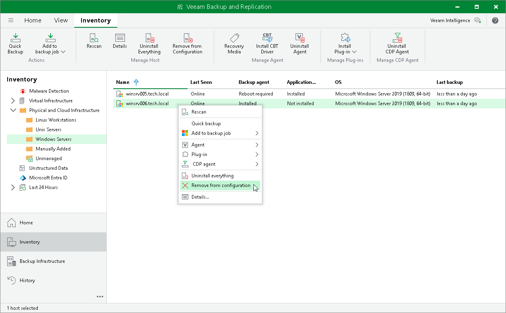

# Removing Computer from Protection Group

You can remove one or more computers from a protection group, for example, if you do not want to protect these computers with Veeam Agent any longer but want to back up data of other computers in the protection group.

When you remove a computer from a protection group, Veeam Backup & Replication removes records about the computer from the Veeam backup console and configuration database but does not uninstall Veeam Agent from the computer. You can remove Veeam Agent from the computer in advance, before you remove the computer from the protection group. To learn more, see [Uninstalling Veeam Agent](agents_protected_computers_uninstall.md).

Alternatively, you can remove a computer from a protection group, and then uninstall Veeam Agent from this computer. Keep in mind that in this case you will have to uninstall Veeam Agent directly on the Veeam Agent computer.

|  |
| --- |
| TIP |
| You can also remove entire protection group from the Veeam Backup & Replication inventory. When you remove a protection group, you can instruct Veeam Backup & Replication to uninstall Veeam Agents from all protected computers included in this protection group. To learn more, see [Removing Protection Group](agents_protection_group_remove.md). |

To remove a computer from a protection group:

1. Open the Inventory view.
2. In the inventory pane, expand the Physical and Cloud Infrastructure node and select the necessary protection group.
3. In the working area, select the necessary computer and click Remove from Configuration on the ribbon or right-click the computer and select Remove from configuration.

Backups created for computers that were removed from a protection group remain intact in the backup location. You can delete this backup data manually later if needed.

|  |
| --- |
|  NOTE |
| You cannot remove a computer from the protection group if this computer is a failover cluster node. |

Alternative Ways to Remove Computer from Protection Group

There are alternative ways to remove computer from protection group that may be suitable for specific situations. For example, you want to remove a Mac computer from a protection group from the Veeam Agent computer side.

Alternative ways of removing computer from protection group differ depending on the type of the protection group that contains the computer you want to remove.

* For a protection group that contains individual computers, edit the protection group and remove the necessary computer at the Computers step of the Edit Protection Group wizard. To learn more, see [Editing Protection Group Settings](agents_protection_group_edit.md).

You can also use this option to remove a computer from the Manually Added protection group. This protection group contains computers that you add directly to a Veeam Agent backup job. To learn more, see [Removing Computer from "Manually Added" Protection Group](#manually_added).

* For a protection group that contains Active Directory objects, edit the protection group and remove the necessary computer account at the Active Directory step of the Edit Protection Group wizard.

Alternatively, if the protection group contains a container, organizational unit, group or entire domain, you can exclude the computer at the Exclusions step of the wizard. To learn more, see [Exclude Objects from Protection Group](protection_group_exclusions.md).

* For a protection group that contains computers listed in a CSV file, remove the record about the necessary computer from the CSV file. During subsequent rescan of the protection group, Veeam Backup & Replication will remove the computer from the protection group.
* For a protection group for pre-installed Veeam Agents, you can remove the computer from the Veeam Agent computer side. The process of removing a computer from a protection group for pre-installed Veeam Agents differs depending on the Veeam Agent computer OS:

* For Windows-based Veeam Agent computers, see the [RemoveOwner](https://helpcenter.veeam.com/docs/agentforwindows/configurator/removeowner.html?ver=13) section in the Veeam Agent Configurator Reference.
* For Linux-based Veeam Agent computers, see the [Deleting Connection to Veeam Backup Server](https://helpcenter.veeam.com/docs/agentforlinux/userguide/manage_vbr_delete.html?ver=13) section in the Veeam Agent for Linux User Guide.
* For Unix-based Veeam Agent computers running the IBM AIX operating system, see the [Deleting Connection to Veeam Backup Server](https://helpcenter.veeam.com/docs/agentforaix/userguide/manage_vbr_delete.html?ver=13) section in the Veeam Agent for IBM AIX User Guide.
* For Unix-based Veeam Agent computers running the Oracle Solaris operating system, see the [Deleting Connection to Veeam Backup Server](https://helpcenter.veeam.com/docs/agentforsolaris/userguide/manage_vbr_delete.html?ver=13) section in the Veeam Agent for Oracle Solaris User Guide.
* For macOS-based Veeam Agent computers, see the [Deleting Connection to Veeam Backup Server](https://helpcenter.veeam.com/docs/agentformac/userguide/manage_vbr_delete.html?ver=13) section in the Veeam Agent for Mac User Guide.

Removing Computer from "Manually Added" Protection Group

Individual computers that you add directly to a Veeam Agent backup job are included in the Manually Added protection group. When you remove such a computer from the backup job, Veeam Backup & Replication does not remove the computer from the Manually Added protection group as well. The computer remains in the Manually Added protection group until you remove the computer from this protection group.

To remove a computer from the Manually Added protection group, you must edit this protection group and remove the computer at the Computers step of the Edit Protection Group wizard. To learn more, see [Editing Protection Group Settings](agents_protection_group_edit.md).

|  |
| --- |
|  NOTE |
| You cannot remove a computer from the Manually Added protection group if this computer is added to a Veeam Agent backup job. |

