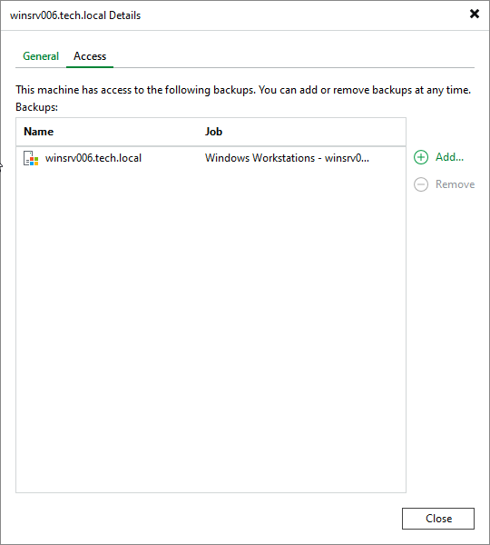
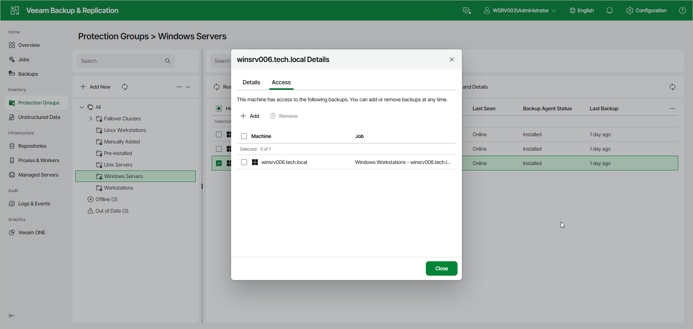

# Managing Backup Access

You can grant or revoke a protected computer's access to specific backups. This allows the computer to restore data from a backup that was originally created for another computer. To learn more about restore operations, see [Restoring Data from Veeam Agent Backups](performing_restore_tasks.md).

|  |
| --- |
| NOTE |
| Consider the following limitations:   * Backup access management works only within backup-policy scope: both the computer that is granted access and the backup being accessed must be tied to backup policies. * You can only grant access to a backup of the same OS as the computer. For example, a Microsoft Windows computer can access only Microsoft Windows backups. * The computer that is granted access to another computer's backup can restore data from that backup but cannot continue the backup chain. * Backup access management does not support Veeam Cloud Connect backups. * In the Veeam Backup & Replication web UI, backup access management is not available for Veeam Agent for Mac machines. To manage backup access for Veeam Agent for Mac machines, use the Veeam Backup & Replication console. |

You can manage backup access in the following ways:

* [Managing Backup Access Using Console](#console)
* [Managing Backup Access Using Web UI](#webui)

Managing Backup Access Using Veeam Backup & Replication Console

To manage backup access for a protected computer in the Veeam Backup & Replication console:

1. Open the Inventory view.
2. In the inventory pane, expand the Physical and Cloud Infrastructure node.
3. In the working area, select the computer and click Access and host details on the ribbon, or right-click the computer and select Access and host details.
4. In the window that opens, click the Access tab.
5. Do one of the following:

* To grant the computer access to a backup, click Add and select the backup.
* To revoke access to a backup, select it in the list and click Remove.

Managing Backup Access Using Veeam Backup & Replication Web UI

To manage backup access for a protected computer in the Veeam Backup & Replication web UI:

1. In the management pane, click Protection Groups.
2. Select the protection group that contains the necessary computer.
3. In the working area, select the check box next to the computer and click Permissions and details on the toolbar. Alternatively, right-click the computer and select Permissions and details.
4. In the window that opens, click the Access tab.
5. Do one of the following:

* To grant the computer access to a backup, click Add and select the backup.
* To revoke access to a backup, select it in the list and click Remove.

Page updated 2026-07-22

