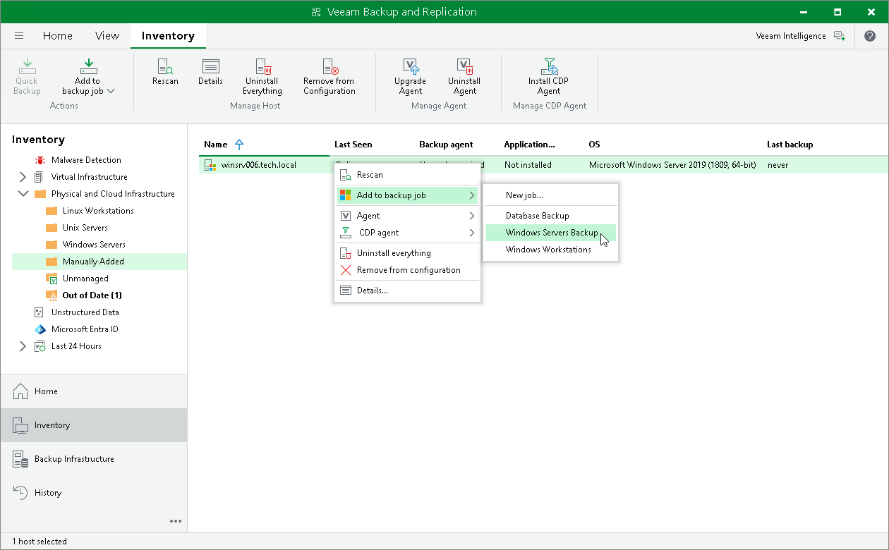
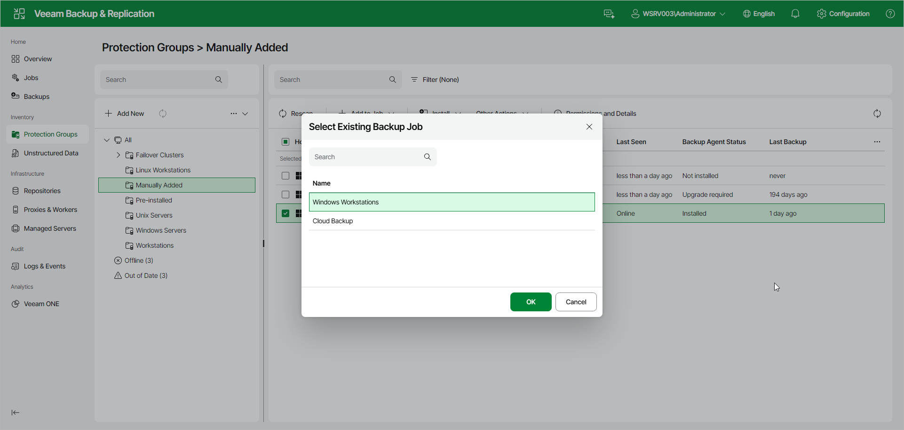

# Adding Computer to Backup Job

You can quickly add a specific protected computer to a Veeam Agent backup job that you have configured in Veeam Backup & Replication.

|  |
| --- |
| NOTE |
| Consider the following:   * You can add a computer to a Veeam Agent backup job configured for computers of the same platform. For example, you can add a Linux computer only to a Veeam Agent backup job for Linux computers. * You can also add a specific protected computer to a new backup job. To learn more, see [Working with Veeam Agent Backup Jobs and Policies](backup_job_tasks.md). |

You can add a protected computer to a backup job in the following ways:

* [Adding Computer to Backup Job Using Console](#console)
* [Adding Computer to Backup Job Using Web UI](#webui)

Adding Computer to Backup Job Using Veeam Backup & Replication Console

To add a protected computer to a backup job in the Veeam Backup & Replication console:

1. Open the Inventory view.
2. In the inventory pane, in the Physical and Cloud Infrastructure node, select a protection group whose computers you want to add to a Veeam Agent backup job and do one of the following:

* In the working area, select the computer that you want to add to the job and click Add to Backup > name of the job on the ribbon.
* In the working area, right-click the computer that you want to add to the job and select Add to backup job > name of the job.

Adding Computer to Backup Job Using Veeam Backup & Replication Web UI

To add a protected computer to a backup job in the Veeam Backup & Replication web UI:

1. In the management pane, click Protection Groups.
2. Select the protection group that contains the necessary computer.
3. In the working area, select the check box next to the computers that you want to add to a backup job. On the toolbar, click Add to Job and select one of the following:

* New Job — to create a new backup job with the selected computers.
* Existing Job — to add the computers to an already created backup job.

Alternatively, right-click the computer that you want to add to a backup job and select Add to Job > New Job or Add to Job > Existing Job.

1. If you selected Existing Job, in the Select Existing Backup Job window, select the necessary job and click OK.
2. If you selected New Job, complete the New Agent Backup Job wizard. To learn more, see [Creating Job for Windows Computers Using Web UI](agent_job_create_win_web.md) or [Creating Job for Linux Computers Using Web UI](agent_job_create_linux_web.md).

Page updated 2026-07-03

