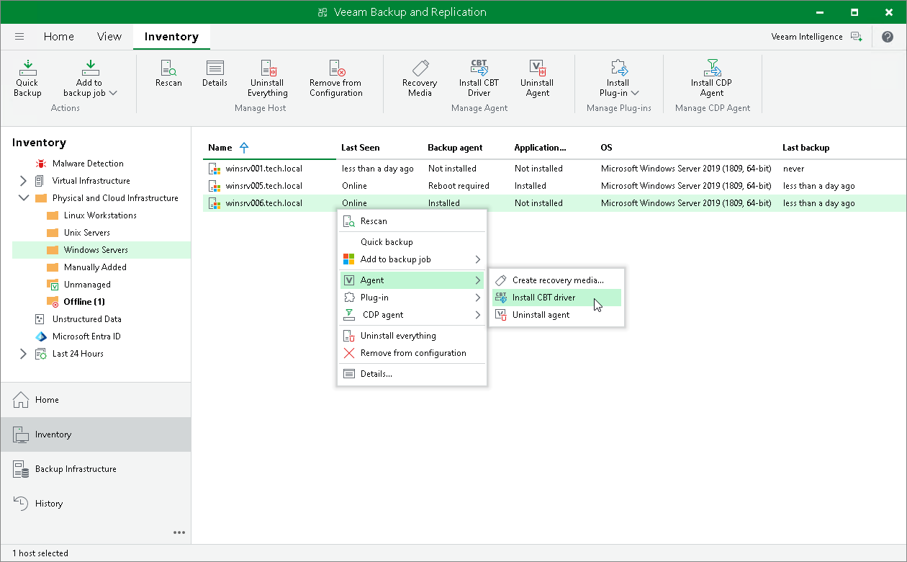
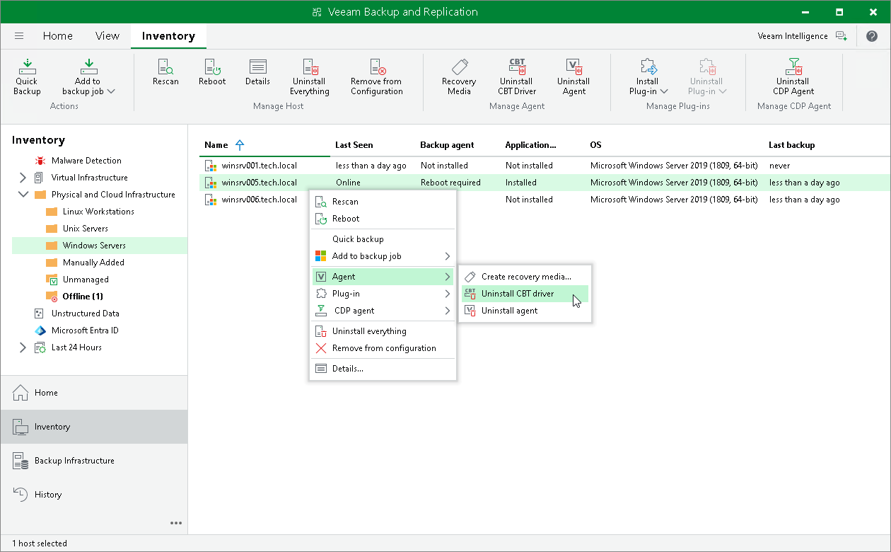

# Installing Veeam CBT Driver

You can use the Veeam Backup & Replication console to quickly install the Veeam changed block tracking (CBT) driver on a protected computer. This operation may be required, for example, if you want to evaluate driver performance on a selected computer rather than deploy driver to all computers in the protection group at once.

|  |
| --- |
|  NOTE |
| If you work with a computer included in a protection group for pre-installed Veeam Agents, you can install and uninstall Veeam CBT driver only from the Veeam Agent computer side using Veeam Agent Configurator. To learn more, see the [InstallCBTDriver](https://helpcenter.veeam.com/docs/agentforwindows/configurator/installcbtdriver.html?ver=13) and [UninstallCBTDriver](https://helpcenter.veeam.com/docs/agentforwindows/configurator/uninstallcbtdriver.html?ver=13) sections in the Veeam Agent Configurator Reference. |

Before you install the Veeam CBT driver, check the following prerequisites:

* The protected computer on which you want to install the driver must run one of the following OSes:

* Microsoft Windows 11 (from versions 22H2 to version 25H2).
* Microsoft Windows 10 General Availability Channel 22H2.
* Microsoft Windows 10 Long-Term Servicing Channel versions 2019 and 2021.
* Microsoft Windows Server OS that is supported by Veeam Agent. For more information, see [System Requirements](agents_system_requirements.md#vaw).

* The protected computer on which you want to install the driver must be powered on and able to be connected over the network.

|  |
| --- |
| IMPORTANT |
| Consider the following:   * Do not install the Veeam CBT driver on a computer running Microsoft Windows Server 2012 R2 if one or more volumes on this computer are encrypted with Microsoft BitLocker (or other encryption tool), or if you plan to use Microsoft BitLocker to encrypt volumes on this computer. Concurrent operation of Microsoft BitLocker and Veeam CBT driver may result in driver failures and may prevent the OS from starting.  * Do not install the Veeam CBT driver on a computer if you plan to use devices with hardware encryption made according to the TCG Opal Security Subsystem Class Specification. Operation of the driver on such devices may lead to a crash of the operating system. To learn more about the TCG Opal Security Subsystem Class Specification, see [this Trusted Computing Group webpage](https://trustedcomputinggroup.org/resource/storage-work-group-storage-security-subsystem-class-opal/). |

To install the Veeam CBT driver on a protected computer:

1. Open the Inventory view.
2. In the inventory pane, expand the Physical and Cloud Infrastructure node and select a protection group that contains the computer on which you want to install the driver.
3. In the working area, select the necessary computer and click Install CBT Driver on the ribbon or right-click the computer and select Agent > Install CBT driver.

|  |
| --- |
| NOTE |
| To enable the CBT driver after installation, you need to reboot the computer. To learn more, see [Rebooting Protected Computer](agents_protected_computers_reboot.md). |

Uninstalling Veeam CBT Driver

You can uninstall the Veeam CBT driver at any time you need. To uninstall the driver:

1. Open the Inventory view.
2. In the inventory pane, expand the Physical and Cloud Infrastructure node and select a protection group that contains the computer on which you want to uninstall the driver.
3. In the working area, select the necessary computer and click Uninstall CBT Driver on the ribbon or right-click the computer and select Agent > Uninstall CBT driver.

|  |
| --- |
|  NOTE |
| To complete the driver uninstallation process, you need to reboot the computer. To learn more, see [Rebooting Protected Computer](agents_protected_computers_reboot.md). |

