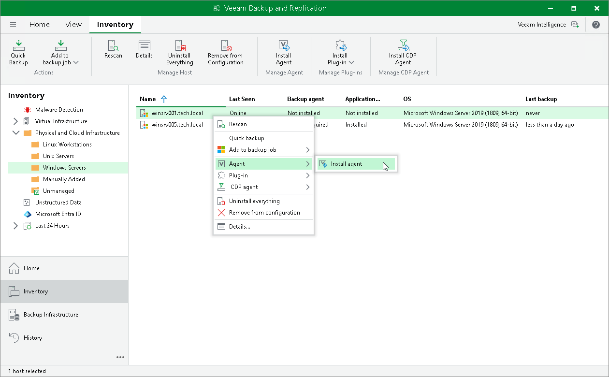

# Installing Veeam Agent

You can install Veeam Agent on a specific protected computer in the inventory. This operation may be required, for example, if you want to test the installation process before allowing Veeam Backup & Replication to deploy Veeam Agent to all computers included in the protection group.

Keep in mind that Veeam Agents for computers that you plan to add to a protection group for pre-installed Veeam Agents require a different installation approach. To learn more, see [Deploying Veeam Agents Using Generated Setup Files](agents_deploy_package.md).

Before you install Veeam Agent, check the following prerequisites:

* The protected computer must be powered on and able to be connected over the network.

* The required version of Veeam Agent must be available on the distribution server.

To install Veeam Agent on a protected computer:

1. Open the Inventory view.
2. In the inventory pane, expand the Physical and Cloud Infrastructure node and select the necessary protection group.
3. In the working area, select the necessary computer and click Install Agent on the ribbon or right-click the computer and select Agent > Install agent.

In some cases, installation of Veeam Agent for Microsoft Windows may require computer reboot. This can happen, for example, if you have earlier versions of .NET runtimes installed on the computer and during the installation process the framework is used by third-party software. You can instruct Veeam Backup & Replication to automatically reboot the Veeam Agent computer. To do so, select the Perform reboot automatically if required check box in the [protection group settings](agents_protection_group_options.md).

|  |
| --- |
| TIP |
| To prevent protected computers from being compromised, Veeam Backup & Replication validates the integrity and authenticity of the Veeam Agent installation package before uploading it to the computer. |

