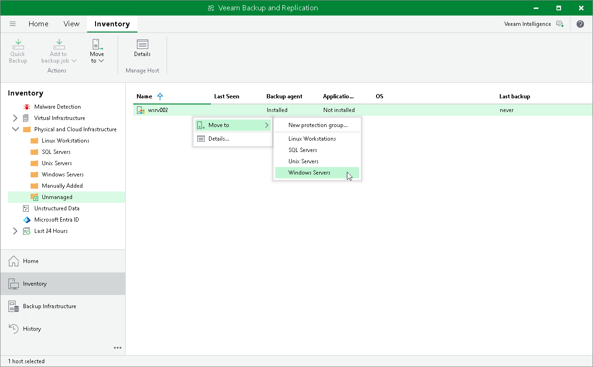

# Moving Computer to Protection Group

In this article

In Veeam Backup & Replication, you can move Veeam Agent computers between protection groups in the following way:

* You can move an unmanaged Veeam Agent computer or a Veeam Agent computer from a protection groups for pre-installed Veeam Agents to a protection group for individual computers. To move a Veeam Agent computer to a protection group for individual computers, [use the Veeam Backup & Replication console](#move).

|  |
| --- |
| IMPORTANT |
| You cannot move Mac computers to a protection group for individual computers. |

* You can also move an unmanaged Veeam Agent computer to a protection group for pre-installed Veeam Agents. You must do it from the Veeam Agent side. This operation is similar to the initial Veeam Agent configuration. To learn more, see one of the following sections depending on the OS of the Veeam Agent computer that you plan to move:

* [Veeam Agent for Microsoft Windows Configuration](deploy_agent_windows.md#configure)
* [Veeam Agent for Linux Configuration](deploy_agent_linux.md#configure)
* [Veeam Agent for Unix Configuration](deploy_agent_unix.md#configure)
* [Veeam Agent for Mac Configuration](deploy_agent_mac.md#configure)

You can move a computer to a new protection group or protection group that you have already created.

* When you move a computer to a new protection group, Veeam Backup & Replication creates the protection group and adds the computer to this group. In the protection group settings, you can define discovery and deployment options according to which Veeam Backup & Replication will process the added computer.
* When you move a computer to an already existing protection group, Veeam Backup & Replication adds this computer to the protection group and starts processing the computer according to discovery and deployment settings defined in the properties of the protection group. Veeam Backup & Replication discovers the added computer, checks whether Veeam Agent running on the computer needs upgrade and upgrades Veeam Agent if needed.

|  |
| --- |
| NOTE |
| * After you move a computer to a protection group, data backup for this computer will be performed by a backup job configured in Veeam Backup & Replication. Veeam Agent running on the computer will start a new backup chain on a target location specified in the backup job settings. The original backup job configured on the Veeam Agent computer will be removed in Veeam Agent, and you will not be able to continue the backup chain created with this job. * You cannot map a Veeam Agent backup job configured in Veeam Backup & Replication to a backup chain that was created on a backup repository by Veeam Agent operating in the standalone mode. |

To move a computer to a protection group:

1. Open the Inventory view.
2. In the inventory pane, expand the Physical and Cloud Infrastructure node and select the protection group that includes the Veeam Agent computer that you want to move.
3. Do either of the following

* If you want to move a computer to a new protection group, in the working area, select the necessary computer and click Move to > New protection group on the ribbon or right click the computer and select Move to > New protection group.
* If you want to move a computer to a protection group that is already created in the inventory, in the working area, select the necessary computer and click Move to > name of the protection group on the ribbon or right click the computer and select Move to > name of the protection group.

Page updated 11/4/2025

Page content applies to build 13.0.1.1071
