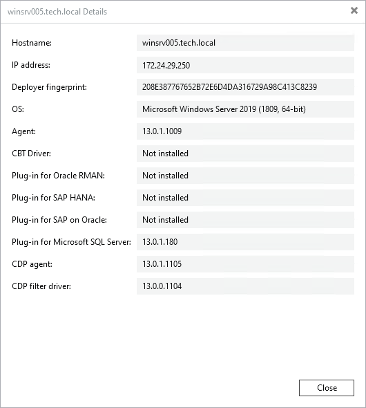

# Viewing Properties

You can view detailed information about protected computers. The detailed information provides the following data:

For all protected computers:

* Hostname
* Operating system
* Veeam Agent version
* Hotfix information, if applicable

Additionally, for Microsoft Windows-based computers:

* IP address
* Deployer certificate fingerprint
* CBT driver version
* Versions of installed Veeam Plug-Ins for enterprise applications
* Versions of Veeam CDP Agent Service and Veeam CDP Volume Filter Driver

Additionally, for Linux-based computers:

* IP address
* Deployer certificate fingerprint
* SSH fingerprint
* SSH key algorithm
* Versions of installed Veeam Plug-Ins for enterprise applications
* Versions of Veeam CDP Agent Service and Veeam CDP Volume Filter Driver

|  |
| --- |
| NOTE |
| IP address and Fingerprint information does not apply to members of protection groups for pre-installed Veeam Agents and cloud machines. Key algorithm information does not apply to members of protection groups for pre-installed Veeam Agents. |

To view detailed information about a protected computer:

1. Open the Inventory view.
2. In the inventory pane, expand the Physical and Cloud Infrastructure node.
3. In the working area, select the computer and click Details on the ribbon or right-click the computer and select Details.

