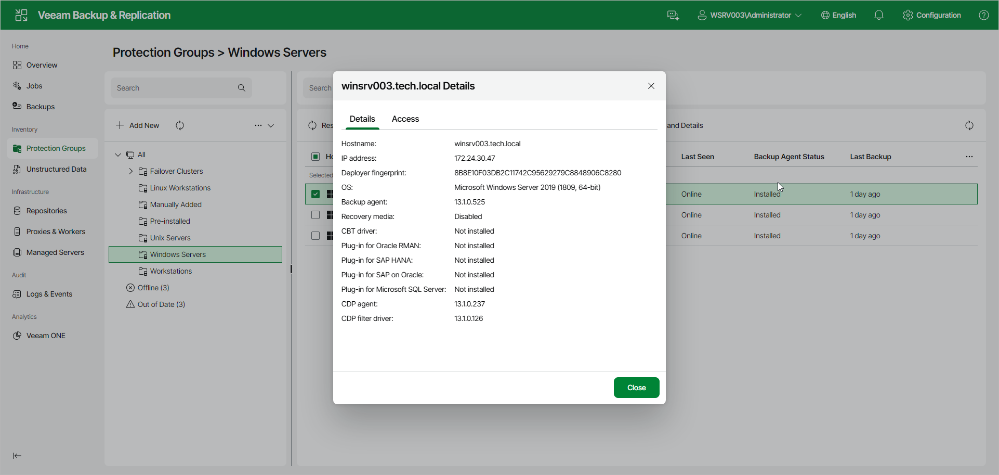

# Viewing Properties

Viewing General Properties

You can view detailed information about protected computers. The detailed information provides the following data:

For all protected computers:

* Hostname
* Operating system
* Veeam Agent version
* Hotfix information, if applicable

Additionally, for Microsoft Windows-based computers:

* IP address
* Deployer certificate fingerprint
* CBT driver version
* Versions of installed Veeam Plug-Ins for enterprise applications
* Versions of Veeam CDP Agent Service and Veeam CDP Volume Filter Driver
* [Veeam Backup & Replication web UI only] Recovery media availability

Additionally, for Linux-based computers:

* IP address
* Deployer certificate fingerprint
* SSH fingerprint
* SSH key algorithm
* Snap driver version
* Versions of installed Veeam Plug-Ins for enterprise applications
* Versions of Veeam CDP Agent Service and Veeam CDP Volume Filter Driver

Additionally, for Unix-based computers:

* IP address
* Deployer certificate fingerprint
* Versions of installed Veeam Plug-Ins for enterprise applications
* Versions of Veeam CDP Agent Service and Veeam CDP Volume Filter Driver

|  |
| --- |
| NOTE |
| IP address and Fingerprint information does not apply to members of protection groups for pre-installed Veeam Agents and cloud machines. Key algorithm information does not apply to members of protection groups for pre-installed Veeam Agents. For Veeam Agent for Oracle Solaris, the Deployer certificate fingerprint field is not populated because Veeam Deployment Kit deployment is not supported for this agent. |

You can view detailed information about a protected computer in the following ways:

* [Viewing Properties Using Console](#console)
* [Viewing Properties Using Web UI](#webui)

Viewing Properties Using Veeam Backup & Replication Console

To view detailed information about a protected computer in the Veeam Backup & Replication console:

1. Open the Inventory view.
2. In the inventory pane, expand the Physical and Cloud Infrastructure node.
3. In the working area, select the computer and do one of the following:

* If the computer has backups, click Access and host details on the ribbon (or right-click the computer and select Access and host details), then click the General tab.
* If the computer has no backups, click Access and host details on the ribbon (or right-click the computer and select Access and host details).

Viewing Properties Using Veeam Backup & Replication Web UI

To view detailed information about a protected computer in the Veeam Backup & Replication web UI:

1. In the management pane, click Protection Groups.
2. Select the protection group that contains the necessary computer.
3. In the working area, select the check box next to the computer and do one of the following:

* If the computer has backups, click Permissions and details on the toolbar (or right-click the computer and select Permissions and details), then click the General tab.
* If the computer has no backups, click Details on the toolbar (or right-click the computer and select Details).

Page updated 2026-07-06

