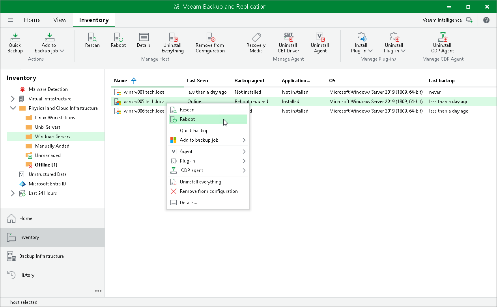

# Rebooting Protected Computer

You can use the Veeam Backup & Replication console to reboot a protected computer running a Microsoft Windows OS. This operation may be required, for example, if you have installed the CBT driver on a selected computer and need to reboot this computer to finish the installation process and enable the driver.

Keep in mind that you cannot reboot a protected computer that is added to a protection group for pre-installed Veeam Agents. To learn more about protection groups for pre-installed Veeam Agents, see [Protection Group Types](agents_protection_groups_types.md).

To reboot a protected computer:

1. Open the Inventory view.
2. In the inventory pane, expand the Physical and Cloud Infrastructure node and select a protection group that contains the computer that requires reboot. The computer that requires reboot is displayed in the Reboot required status in the Veeam Backup & Replication console.
3. In the working area, select the necessary computer and click Reboot on the ribbon or right-click the computer and select Reboot.
4. In the displayed window, click Yes.

|  |
| --- |
| TIP |
| You can also reboot a computer with a different status than the Reboot required status. To do this, select the necessary computer, press and hold the [Ctrl] key, right-click the computer and select Agent > Reboot. |

