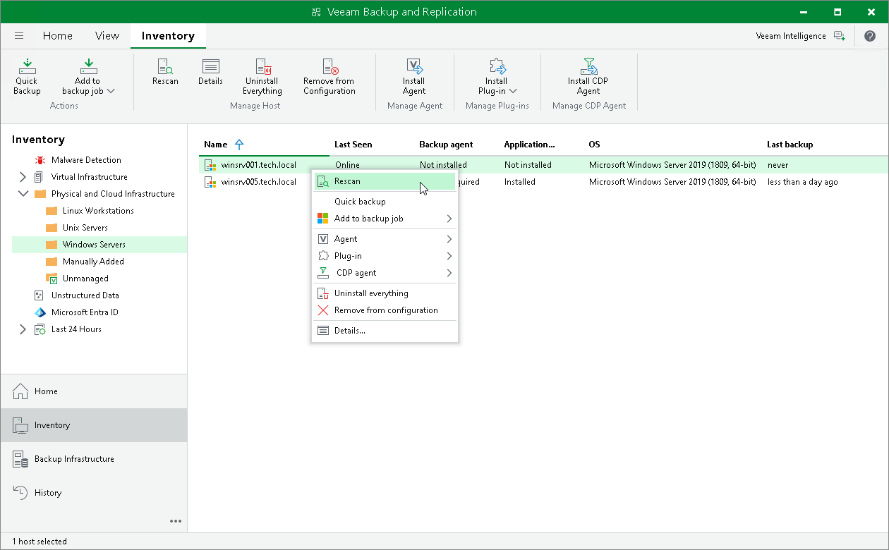

# Rescanning Protected Computer

You can rescan protected computers added to the inventory. The rescan operation may be required, for example, if you want to refresh information about the protected computer in the Veeam Backup & Replication database. During the rescan operation, Veeam Backup & Replication communicates to Veeam Installer Service running on the protected computer, retrieves information about the computer and stores this information to the configuration database.

Keep in mind that rescan is not available for protection groups for pre-installed Veeam Agents and their members. Veeam Agents installed on computers included in such protection groups connect to Veeam Backup & Replication every 6 hours and provide information about the Veeam Agent computer. If necessary, you can synchronize Veeam Agent with Veeam Backup & Replication running a command from the Veeam Agent computer. To learn more, see [Backup Policy Application Methods](agents_policy_apply.md).

|  |
| --- |
| NOTE |
| During the rescan of a separate protected computer, Veeam Backup & Replication does not perform [deployment operations](agents_protection_group_options.md) specified in the protection group settings. To perform the deployment operations, [rescan the protection group](agents_protection_group_rescan.md). |

To rescan a protected computer:

1. Open the Inventory view.
2. In the inventory pane, expand the Physical and Cloud Infrastructure node and select the necessary protection group.
3. In the working area, select the computer and click Rescan on the ribbon or right-click the computer and select Rescan.

