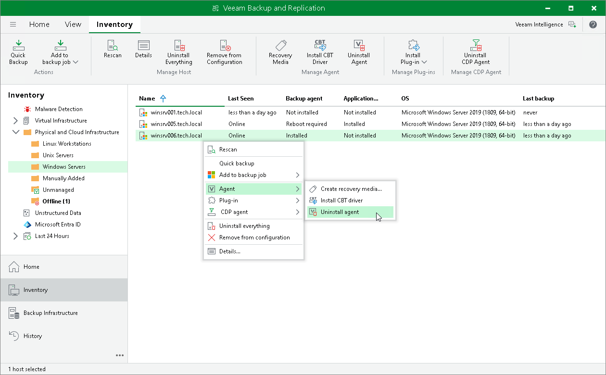

# Uninstalling Veeam Agent

You can remove Veeam Agent from a specific protected computer, for example, if you want to reinstall Veeam Agent running on the protected computer.

Keep in mind that you can uninstall Veeam Agent on a computer added to a protection group for pre-installed Veeam Agents only from the Veeam Agent computer side. To learn more about protection groups for pre-installed Veeam Agents, see [Protection Group Types](agents_protection_groups_types.md).

|  |
| --- |
| TIP |
| You can remove Veeam Agent and other Veeam components as one operation. To learn more, see [Uninstalling Veeam Agent and Other Veeam Components](agents_protected_computers_remove.md). |

To uninstall Veeam Agent:

1. Open the Inventory view.
2. In the inventory pane, expand the Physical and Cloud Infrastructure node and select the necessary protection group.
3. In the working area, select the necessary computer and click Uninstall Agent on the ribbon or right-click the computer and select Agent > Uninstall agent.
4. In the displayed notification window, click Yes.

|  |
| --- |
| NOTE |
| Consider the following:   * If automatic installation of Veeam Agent is enabled in the protection group settings, after you remove Veeam Agent from a selected computer, Veeam Backup & Replication will install Veeam Agent on this computer during the next rescan job session started by schedule. * Prerequisite components installed and used by Veeam Agent are not removed during the uninstall process. You can remove the remaining components from the side of the computer from which you uninstalled Veeam Agent.  * If you uninstall Veeam Agent for Microsoft Windows added to the protection group for pre-installed Veeam Agents and then re-install on the same computer, Veeam Agent will not connect to Veeam backup server automatically. To connect Veeam Agent, you must repeat the configuration step of the Veeam Agent deployment scenario. To learn more, see [Deploying Veeam Agents Using Generated Setup Files](agents_deploy_package.md). |

