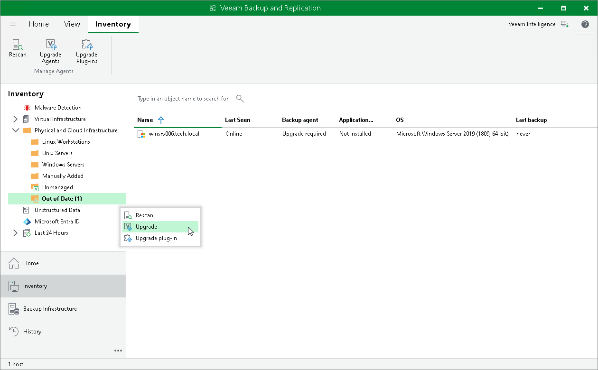
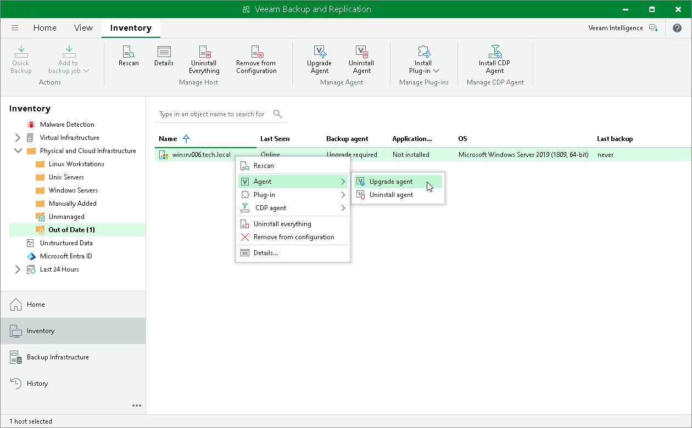

# Upgrading from Veeam Backup & Replication Console

In this article

In the Veeam Backup & Replication console, you can upgrade Veeam Agent on the computers that are added to a protection group of one of the following types:

* Protection group for individual computers (Veeam Agent for Microsoft Windows, Veeam Agent for Linux, Veeam Agent for IBM AIX and Veeam Agent for Oracle Solaris)
* Protection group for computers from CSV file (Veeam Agent for Microsoft Windows, Veeam Agent for Linux, Veeam Agent for IBM AIX and Veeam Agent for Oracle Solaris)
* Protection group for Microsoft Active Directory objects (Veeam Agent for Microsoft Windows)
* Protection group for cloud machines (Veeam Agent for Microsoft Windows and Veeam Agent for Linux)

Automatic and Manual Upgrades

From the Veeam Backup & Replication console, you can upgrade Veeam Agent on a protected computer in two ways:

* [Automatically](#auto) — You can use this method to upgrade all outdated Veeam Agents on computers in a protection group. To enable Veeam Agent auto updates, select the Enable auto-update for installed components option in the protection group settings. For more information, see [Creating Protection Groups](protection_group_add.md).
* [Manually](#manual) — You can upgrade Veeam Agent on an individual computer in a protection group. This method may be required, for example, if you did not allow Veeam Backup & Replication to automatically upgrade Veeam Agent on computers included in the protection group and want to test the upgrade process on a selected computer first.

Before You Begin

Before you upgrade Veeam Agent, verify the following:

* The protected computer is powered on and able to be connected over the network.
* The required version of Veeam Agent is available on the Veeam backup server.

* The protected computer meets the [system requirements](agents_system_requirements.md).

|  |
| --- |
| IMPORTANT |
| The upgrade of Veeam Agents on OSes that were only supported by earlier Veeam Backup & Replication versions is not possible. On these OSes, only the latest available versions of Veeam Agents are compatible with Veeam Backup & Replication, but functionality can be limited.  To learn more, see [Supported Veeam Agents](agents_supported_veeam_agents.md). |

* There are no running jobs.

We recommend that you do not stop running jobs and let them complete successfully. Disable any periodic jobs temporarily to prevent them from starting during the upgrade. If the protected computer runs VSS-aware applications and backup of database logs (Microsoft SQL Server transaction logs or Oracle archived logs) is enabled in the backup job for the computer, disable this backup job too.

|  |
| --- |
| TIP |
| During the protected computers discovery process, Veeam Backup & Replication checks the version of Veeam Agent running on a protected computer and the version of Veeam Agent available on the Veeam Backup & Replication server. If a newer version of Veeam Agent becomes available, and automatic upgrade of Veeam Agent is disabled for a protection group, Veeam Backup & Replication puts a computer to the Upgrade required state.  In addition, Veeam Backup & Replication includes computers that require upgrade of Veeam Agent in the Out of Date protection group. You can upgrade Veeam Agent on all computers that require upgrade at once. To learn more, see [Upgrading Veeam Agent on Multiple Computers](#upgrade). |

Upgrading Veeam Agent on Multiple Computers

You can automatically upgrade Veeam Agent on all computers that require upgrade at once. To upgrade Veeam Agent on protected computers:

1. Open the Inventory view.
2. In the inventory pane, in the Physical and Cloud Infrastructure node, select the Out of Date protection group and click Upgrade Agents on the ribbon or right-click the Out of Date protection group and select Upgrade.

|  |
| --- |
| NOTE |
| In some cases, upgrade to a new version of Veeam Agent for Microsoft Windows may require computer reboot. |

Upgrading Veeam Agent on Individual Computers

To upgrade Veeam Agent on a protected computer:

1. Open the Inventory view.
2. In the inventory pane, expand the Physical and Cloud Infrastructure node and select the necessary protection group.
3. In the working area, select the necessary computer and click Upgrade Agent on the ribbon or right-click the computer and select Agent > Upgrade agent.

|  |
| --- |
| NOTE |
| In some cases, upgrade to a new version of Veeam Agent for Microsoft Windows may require computer reboot. |

Page updated 11/12/2025

Page content applies to build 13.0.1.1071
