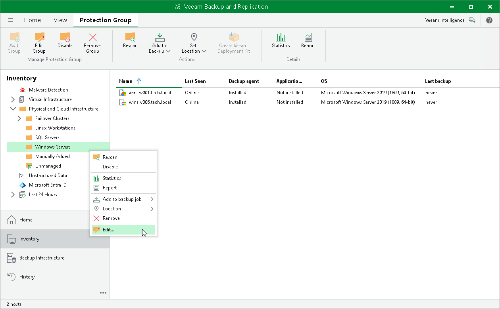
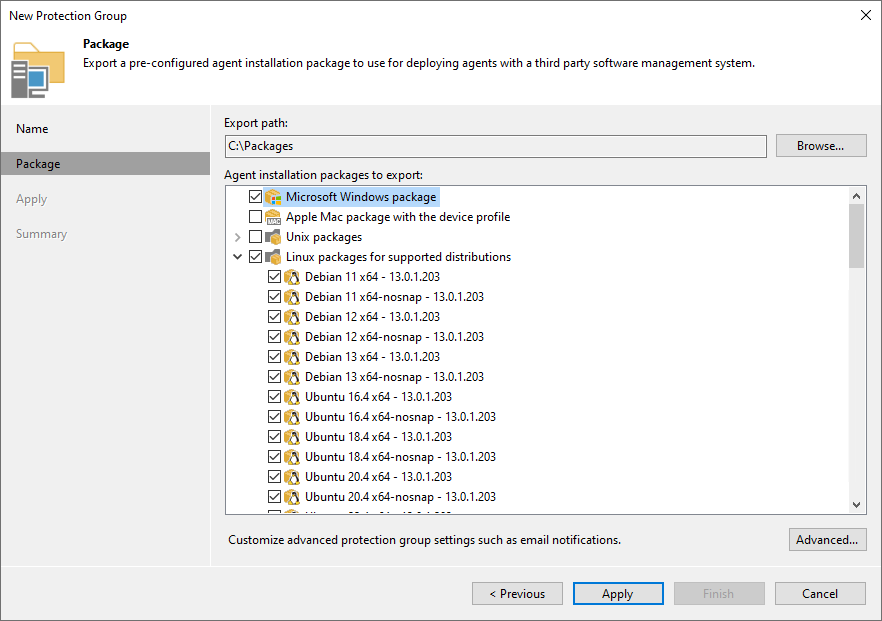

# Upgrading on Protected Computer Side

You must perform the upgrade of Veeam Agent on the computers added to protection groups for pre-installed Veeam Agents on the protected computer side.

|  |
| --- |
| NOTE |
| Upgrade of Veeam Agent on the protected computer side is the only option available for Veeam Agent for Mac. |

|  |
| --- |
| TIP |
| During each synchronization session, Veeam Backup & Replication checks the version of Veeam Agents installed on the protected computers. If the Veeam Agent version does not coincide with the version of Veeam Backup & Replication, Veeam Agent computer will be moved to the Out of Date protection group. |

Before You Begin

Before you upgrade pre-installed Veeam Agent, do the following:

* Check that the latest update for Veeam Backup & Replication is installed on your backup server. To learn more, see [Upgrading to Veeam Backup & Replication 13](upgrade_vbr.md).
* Make sure that Veeam Backup & Replication remote components, such as the distribution server, are updated.
* Make sure that the Veeam Agent computer meets the [system requirements](agents_system_requirements.md).

|  |
| --- |
| IMPORTANT |
| The upgrade of Veeam Agents on computers running 32-bit OSes is not supported. On these OSes, only the latest available versions of Veeam Agents will be compatible with Veeam Backup & Replication, but functionality will be limited.  To learn more, see [Supported Veeam Agents](agents_supported_veeam_agents.md). |

* Make sure that a user account that you plan to use for installation on the Veeam Agent computer side has Local Administrator privileges.

Updating Protection Group Settings

To update pre-installed Veeam Agent, you must generate new Veeam Agent setup files on the Veeam Backup & Replication side. To do so, edit the protection group settings:

1. Open the Inventory view.
2. In the inventory pane, expand the Physical and Cloud Infrastructure node.
3. In the inventory pane, select the protection group for pre-installed Veeam Agents that you want to update and click Edit Group on the ribbon or right-click the protection group for pre-installed Veeam Agents that you want to update and select Properties.

1. At the Package step, check that the export path and setup files for OSes that run on computers with Veeam Agents you want to update are specified correctly.

1. Click Apply to generate setup files. Then click Finish to close the wizard.

Upgrading Veeam Agent on the Protected Computer Side

On the Veeam Agent computer side, the update procedure differs depending on the OS of the protected computer:

* [Upgrade procedure for Microsoft Windows computers](pre_installed_agent_upgrade_windows.md)
* [Upgrade procedure for Linux computers](pre_installed_agent_upgrade_linux.md)
* [Upgrade procedure for Unix computers with IBM AIX OS](pre_installed_agent_upgrade_aix.md)
* [Upgrade procedure for Unix computers with Oracle Solaris OS](pre_installed_agent_upgrade_solaris.md)
* [Upgrade procedure for Mac computers](pre_installed_agent_upgrade_mac.md)

