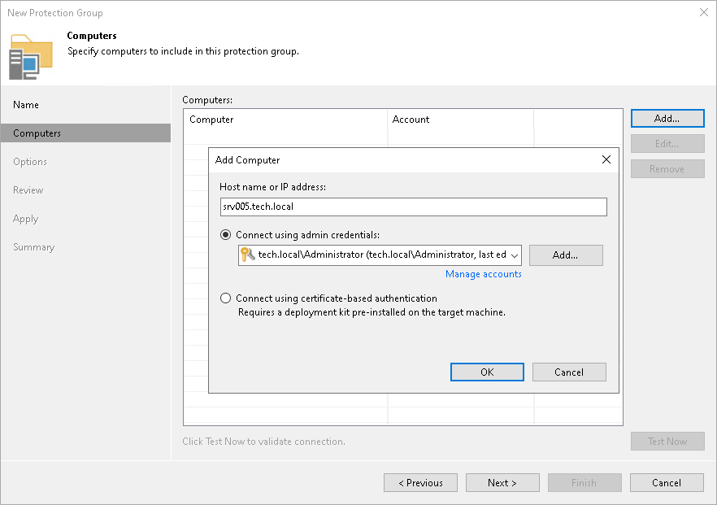

# Step 3. Specify Computers

At the Computers step of the wizard, specify computers that you want to add to the protection group.

To add a computer to a protection group:

1. Click Add.
2. In the Add Computer window, in the Host name or IP address field, enter a full DNS name, hostname or IP address of the computer that you want to add to the protection group.
3. Select a method to connect to the computer:

* Connect using admin credentials. In this case, from the Credentials list, select a user account that has administrative permissions on the computer that you want to add to the protection group. Veeam Backup & Replication will use this account to connect to the protected computer and perform the necessary operations on the computer: upload and install Veeam Agent, and so on.

|  |
| --- |
| IMPORTANT |
| You cannot use this method to back up a non-domain joined Veeam Agent for Microsoft Windows computer to Veeam Backup & Replication on Linux. In this case, you must use the [certificate-based authentication](#certauth) method. |

If you have not set up credentials beforehand, click the Manage accounts link or click Add on the right to add credentials.

You can add the following types of credentials:

* Stored credentials. Select stored credentials if you want Veeam Backup & Replication to use the specified user name and password for each connection to Veeam Agent.
* [For Linux computers] Single-use credentials. Select single-use credentials if you do not want Veeam Backup & Replication to store credentials in the configuration database. With this option selected, Veeam Backup & Replication will use the specified user name and password to deploy Veeam components. After the components are successfully deployed, Veeam Backup & Replication will use Veeam Transport Service to communicate with the Veeam Agent computer.

The user name can be specified in the following formats:

* DNS.DOMAIN.NAME\USERNAME
* USERNAME@DNS.DOMAIN.NAME
* HOSTNAME\USERNAME — if you use Veeam Backup & Replication on Microsoft Windows
* DOMAIN\USERNAME — if you use Veeam Backup & Replication on Microsoft Windows

* [For Microsoft Windows and Linux computers] Connect using certificate-based authentication. Select this option, if you chose to pre-install Veeam Deployer Service on the computer that you want to add to the protection group. In this case, Veeam Backup & Replication will communicate with the computer using a certificate. Veeam Backup & Replication will install Transport Service that will be used to perform the necessary operations on the computer including upload and installation of Veeam Agent. To learn more, see [Deploying Veeam Agent Using Veeam Deployment Kit](agents_deploy_deployer.md).

If you want to change the connection method after you create a protection group, you can do this by [editing the protection group settings](agents_protection_group_edit.md).

1. Repeat steps 1–3 for every computer that you want to add to the protection group.
2. To check if Veeam Backup & Replication can communicate with computers added to the protection group, click Test Now. Veeam Backup & Replication will use the specified method to connect to all computers in the list.

|  |
| --- |
| NOTE |
| If you chose to manually add computers to the list of trusted hosts in Veeam Backup & Replication, when you test connection to an unknown computer in the protection group settings, the test operation will complete with the Failed status. This happens because Veeam Backup & Replication cannot connect to the untrusted computer before you add this computer to the list of trusted hosts. To learn more, see [Validating Untrusted Hosts](linux_fingerprint_validate.md). |

