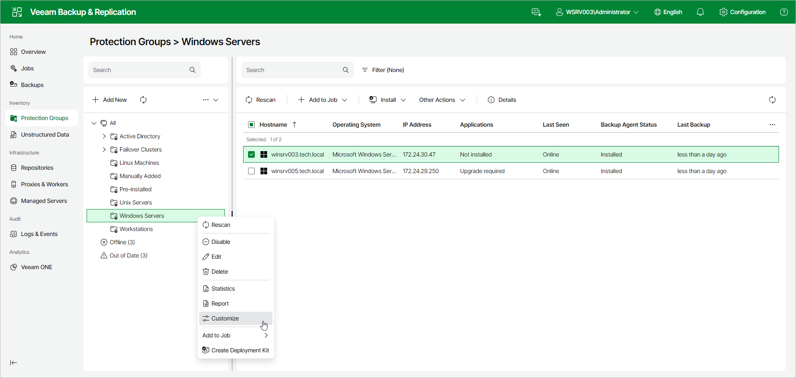

# Customizing Veeam Agent Control Panel

You can customize the appearance and behavior of the Veeam Agent for Microsoft Windows control panel that runs on protected computers. For example, you can match the Veeam Agent branding to your company brand, or hide specific interface elements from end users.

You can apply customization settings in one of the following ways:

* [From Veeam Backup & Replication](#vbr) — you configure customization settings for a protection group in the Veeam Backup & Replication web UI, and Veeam Backup & Replication applies these settings to all Veeam Agents in the protection group.
* [Locally on the protected computer](#local) — you place branding files and a configuration file in a dedicated folder on the protected computer and restart the Veeam Agent tray application to apply the settings.

|  |
| --- |
| NOTE |
| Consider the following:   * Customization settings are applied only to Veeam Agent for Microsoft Windows version 13.1 or later. Earlier versions ignore the new settings. * Customization settings are visible only on computers that can run a Veeam Agent control panel — computers protected by Veeam Agent backup policies. For this reason, customization settings do not affect computers protected by backup jobs managed by the backup server. |

Customizing Veeam Agent Control Panel from Veeam Backup & Replication

You can configure customization settings for all computers in a protection group at once. Veeam Backup & Replication applies the settings to the protected computers during the next protection group rescan.

|  |
| --- |
| NOTE |
| Customization settings can be configured in the Veeam Backup & Replication web UI only. |

To customize the Veeam Agent control panel for a protection group:

1. In the management pane, click Protection Groups.
2. Right-click the necessary protection group, or select the protection group and select Customize from the Other Actions drop-down list.
3. In the Customize window, on the User Interface tab, specify the appearance settings for the Veeam Agent control panel:

* In the Logo text field, enter the text that will appear in the header of the Veeam Agent control panel. The text can contain up to 16 characters.
* In the Logo icon field, click Browse and select a 20×20 PNG file to use as the logo icon.
* In the Tray icon field, click Browse and select a 16×16 ICO file to use as the tray icon. The tray icon is static — the backup activity animation is not applied to custom icons.
* In the Accent color field, specify the HEX color code to use as the accent color in the Veeam Agent control panel.

1. Click the Settings tab to specify behavior settings for the Veeam Agent control panel:

* Select the Hide manual backup run buttons check box to hide the buttons that allow end users to start a backup manually.
* Select the Hide About tab check box to hide the About tab in the Veeam Agent control panel.
* Select the Hide Support tab check box to hide the Support tab in the Veeam Agent control panel. The Submit Feedback and Technical Support options in this tab are also hidden.
* Select the Hide tray icon check box to hide the Veeam Agent tray icon on protected computers.
* To use a custom help center link instead of the default one, turn on the Change link to online help option and specify the URL in the Custom link for help center field.

1. Click Apply.
2. Rescan the protection group to distribute the new settings to Veeam Agents. After the rescan finishes, restart the Veeam Agent tray application on each affected computer to make the new settings take effect.

To revert all customization settings back to their defaults, in the Customize window, click Reset to Default, click Yes in the confirmation window and rescan the protection group.

Customizing Veeam Agent Control Panel Locally on Protected Computers

You can apply customization settings directly on a protected computer by placing branding files and a configuration file in a dedicated folder. This method does not require Veeam Backup & Replication and is applied only to the local computer.

To apply customization settings locally:

1. On the protected computer, navigate to the C:\ProgramData\Veeam\EndpointBranding\ folder.
2. To replace the tray icon, place a 16×16 ICO file named TrayLogo.ico in the folder.
3. To replace the control panel logo icon, place a 20×20 PNG file named MainWindowLogo.png in the folder.
4. To customize the accent color and control panel settings, copy the Config.template.xml file to Config.xml in the same folder and set the following attributes on the BrandingConfiguration element:

* [Optional] Specify the accent color for the Veeam Agent control panel. To do this, set the AccentColorCode value to the color code in hexadecimal format, for example "#1F6AFF". If you leave the value empty, Veeam Backup & Replication uses the default product color.
* [Optional] Specify custom text to display in the header of the Veeam Agent control panel. To do this, set the MainWindowHeaderText value to the necessary text. The text can contain up to 16 characters. If you leave the value empty, Veeam Backup & Replication uses the default text.
* [Optional] Specify a custom URL for the Online Help link on the Support tab of the Veeam Agent control panel. To do this, set the CustomHelpCenterLink value to the necessary URL. If you leave the value empty, Veeam Backup & Replication uses the default URL.
* Set the HideManualBackupRuns value to "True" if you want to hide the Backup Now button and other manual backup controls in the Veeam Agent control panel. The default value is "False".
* Set the HideAboutTab value to "True" if you want to hide the About tab in the Veeam Agent control panel. The default value is "False".
* Set the HideSupportTab value to "True" if you want to hide the Support tab in the Veeam Agent control panel. The default value is "False".
* Set the HideTrayApp value to "True" if you want to hide the Veeam Agent tray icon in the notification area. The default value is "False".

Do not modify the Version attribute.

1. Restart the Veeam Agent tray application. To do this, exit the tray application, and then run Veeam Agent for Microsoft Windows from the Windows Start menu.

|  |
| --- |
| <!--   Veeam Agent for Windows branding configuration template.   Copy this file to 'C:\ProgramData\Veeam\EndpointBranding\Config.xml' to apply custom branding.     Logo files (optional):     C:\ProgramData\Veeam\EndpointBranding\MainWindowLogo.png - Main window logo (PNG, 20x20 px).     C:\ProgramData\Veeam\EndpointBranding\TrayLogo.ico - System tray icon (ICO, 16x16 px)     Version                                Configuration format version. Do not modify this setting.   AccentColorCode                      Accent color in hexadecimal format, for example "#1F6AFF". Leave empty to use the default product color.   HideManualBackupRuns           Backup controls. Set to "True" to hide manual backup actions, such as "Backup Now". Default: "False".   HideAboutTab                       About page in the control panel. Set to "True" to hide the About tab. Default: "False".   HideSupportTab                     Support page in the control panel. Set to "True" to hide the Support tab. Default: "False".   HideTrayApp                        Tray application in the notification area. Set to "True" to hide the system tray application. Default: "False".   CustomHelpCenterLink           Custom URL for the Help Center link. Leave empty to use the default URL.   MainWindowHeaderText           Custom text displayed in the main window header (up to 16 characters). Leave empty to use the default text. --> <BrandingConfiguration Version="1" AccentColorCode="#1F6AFF" HideManualBackupRuns="True" HideAboutTab="False" HideSupportTab="False" HideTrayApp="False" CustomHelpCenterLink="https://helpcenter.example.com" MainWindowHeaderText="Company Backup" /> |

To reset local customization settings:

1. On the protected computer, navigate to the C:\ProgramData\Veeam\EndpointBranding\ folder.
2. Rename or remove the Config.xml file and remove all custom ICO and PNG files.
3. Restart the Veeam Agent tray application.

Page updated 2026-07-21

