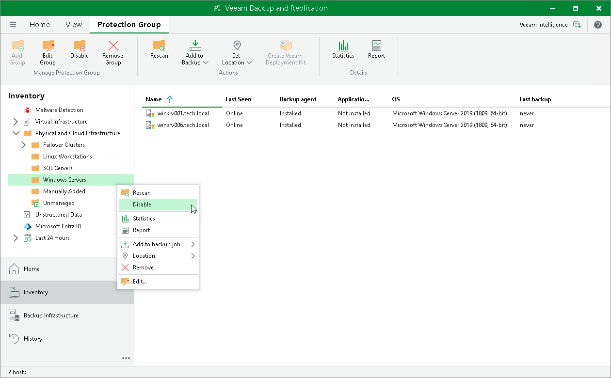

# Disabling Protection Group

You can temporary disable a protection group configured in the inventory. When you disable a protection group, you disable scheduled discovery of protected computers added to this protection group. This may be required, for example, if a new version of Veeam Agent appears on the Veeam Backup & Replication server, and you do not want to deploy Veeam Agent to all protected computers at once. Instead, you can disable the protection group, test the deployment process on a specific computer in this group, and then enable the protection group to let Veeam Backup & Replication deploy Veeam Agent to remaining computers.

When you disable a protection group, Veeam Backup & Replication does not start the rescan job upon schedule defined in the protection group settings. However, you can start the discovery process manually if needed. To learn more, see [Rescanning Protection Group](agents_protection_group_rescan.md).

Disabling a protection group does not affect processing of Veeam Agent computers included in this protection group. If a protected computer is added to a Veeam Agent backup job, and the backup job is scheduled to start at the time when the protection group is in the disabled state, the backup job will run as usual.

|  |
| --- |
|  NOTE |
| You cannot disable default protection groups that act as filters used to display protected computers of a specific type: Unmanaged, Out of Date, Offline and Untrusted. |

To disable automatic discovery for the protection group:

1. Open the Inventory view.
2. In the inventory pane, expand the Physical and Cloud Infrastructure node.
3. In the inventory pane, select the necessary protection group and click Disable on the ribbon or right-click the necessary protection group and select Disable.

To enable automatic discovery for the protection group:

1. Open the Inventory view.
2. In the inventory pane, expand the Physical and Cloud Infrastructure node.
3. In the inventory pane, select the necessary protection group and click Disable on the ribbon or right-click the necessary protection group and select Disable.

|  |
| --- |
|  TIP |
| After you disable a protection group for pre-installed Veeam Agents, Veeam Backup & Replication does not add new members to this protection group. If the Veeam Agent computer user tries to connect to the Veeam backup server with the configuration file, the user will get an error message. To learn more about protection group types, see [Protection Group Types](agents_protection_groups_types.md). |

