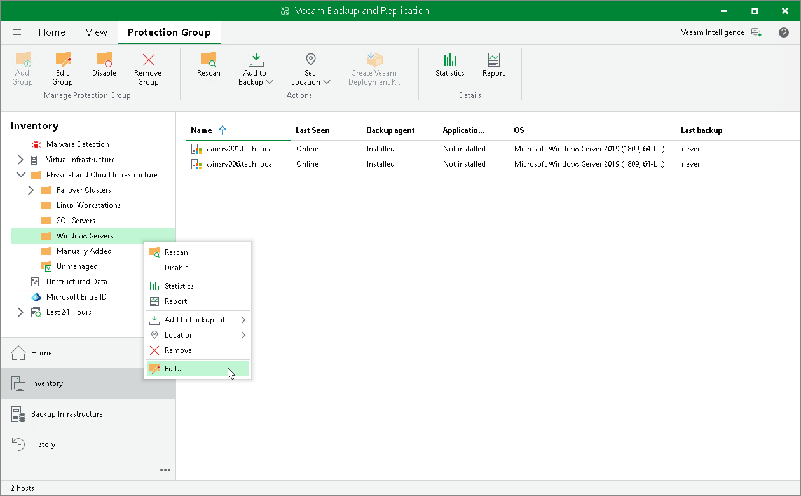
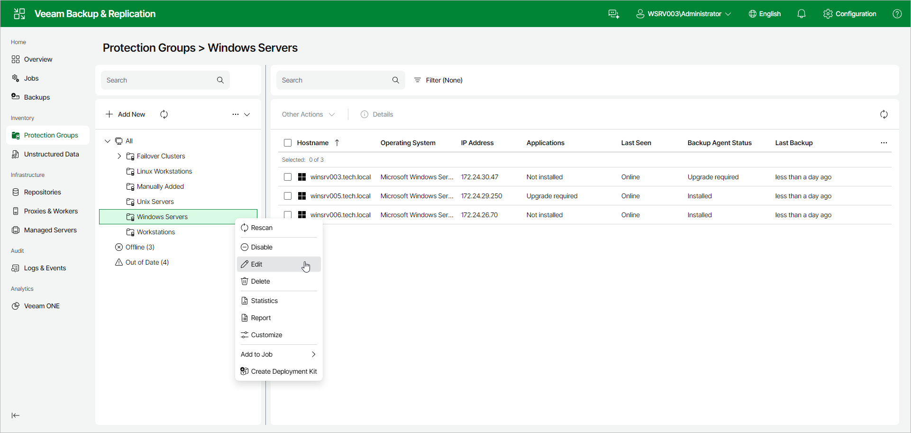

# Editing Protection Group Settings

You can edit settings of a protection group. This operation may be required, for example, if you want to add/remove computers to/from a protection group or change settings for protected computers discovery and Veeam Agent deployment defined in the properties of the protection group.

|  |
| --- |
| NOTE |
| Consider the following:   * You cannot change the type of a protection group when editing protection group settings.  * For the Manually Added protection group, you can change only a limited number of settings. In particular, you can edit protected computers discovery and Veeam Agent deployment options (except for changing the distribution server for the protection group). You can also remove from this protection group computers that are no longer included in a Veeam Agent backup job.  * You cannot edit settings of default protection groups that act as filters used to display protected computers of a specific type: Unmanaged, Out of Date, Offline and Untrusted. |

You can edit protection group settings in the following ways:

* [Editing Protection Group Settings Using Console](#console)
* [Editing Protection Group Settings Using Web UI](#webui)

Editing Protection Group Settings Using Veeam Backup & Replication Console

To edit protection group settings in the Veeam Backup & Replication console:

1. Open the Inventory view.
2. In the inventory pane, expand the Physical and Cloud Infrastructure node.
3. In the inventory pane, select the protection group that you want to edit and click Edit Group on the ribbon or right-click the protection group that you want to edit and select Edit.
4. Edit protection group settings as required.

Editing Protection Group Settings Using Veeam Backup & Replication Web UI

To edit protection group settings in the Veeam Backup & Replication web UI:

1. In the management pane, click Protection Groups.
2. Right-click the protection group that you want to edit, or select the protection group and select Edit from the Other drop-down list.
3. Edit protection group settings as required.

Page updated 2026-07-02

