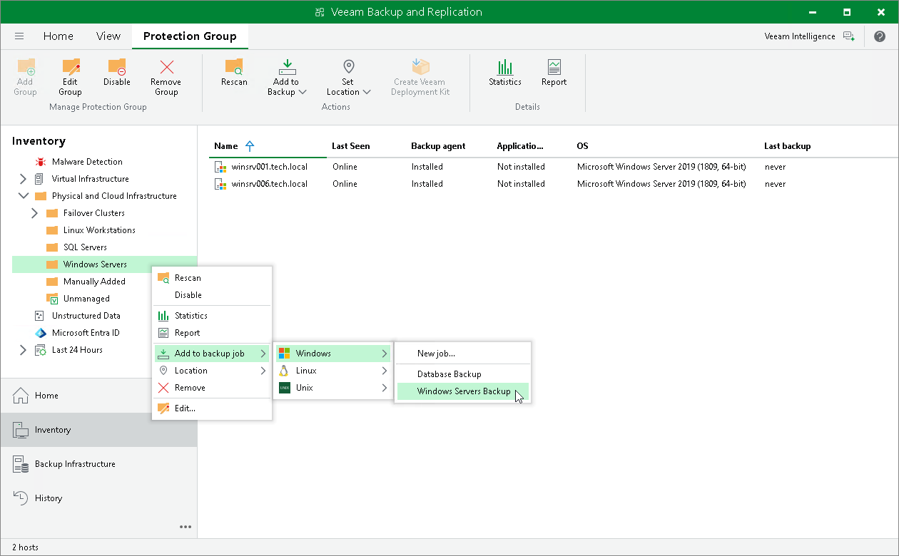
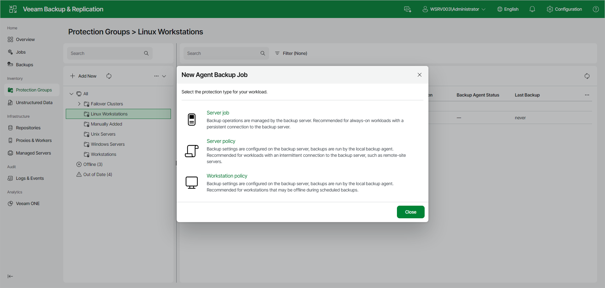

# Adding Protection Group to Backup Job

You can quickly add an entire protection group to a Veeam Agent backup job configured in Veeam Backup & Replication.

Before working with protection groups, consider the following limitations:

* You can add a protection group for pre-installed Veeam Agents only to a backup policy (Veeam Agent backup job managed by . Veeam Agent backup jobs managed by the backup server are not supported by this type of protection groups. To learn more about backup job types, see [Working with Veeam Agent Backup Jobs and Policies](backup_job_tasks.md).

* You can add a protection group for cloud machines only to a Veeam Agent backup job managed by the backup server. Backup policies are not supported by this type of protection group. To learn more about backup job types, see [Working with Veeam Agent Backup Jobs and Policies](backup_job_tasks.md).
* You cannot add both cloud machines and physical computers to the same backup job.
* If you add a protection group that contains computers running different OSes to a Veeam Agent backup job for computers running a certain OS, Veeam Backup & Replication will automatically exclude computers running other OSes from this backup job.

For example, if you add protection group that contains Microsoft Windows, Linux, and Mac computers to a Veeam Agent backup job for Linux computers, Veeam Backup & Replication will automatically exclude Microsoft Windows and Mac computers from this backup job.

You can add a protection group to a Veeam Agent backup job in the following ways:

* [Adding Protection Group to Backup Job Using Console](#console)
* [Adding Protection Group to Backup Job Using Web UI](#webui)

Adding Protection Group to Backup Job Using Veeam Backup & Replication Console

To add a protection group to a Veeam Agent backup job in the Veeam Backup & Replication console:

1. Open the Inventory view.
2. In the inventory pane, expand the Physical and Cloud Infrastructure node and do one of the following:

For Microsoft Windows computers

* In the inventory pane, select the protection group that you want to add to the backup job and click Add to Backup > Windows > New job... or name of an existing job on the ribbon.
* In the inventory pane, right-click the protection group that you want to add to the backup job and select Add to backup job > Windows > New job... or name of an existing job.

For Linux computers

* In the inventory pane, select the protection group that you want to add to the backup job and click Add to Backup > Linux > New job... or name of an existing job on the ribbon.
* In the inventory pane, right-click the protection group that you want to add to the backup job and select Add to backup job > Linux > New job... or name of an existing job.

For Unix computers

* In the inventory pane, select the protection group that you want to add to the backup job and click Add to Backup > Unix > New job... or name of an existing job on the ribbon.
* In the inventory pane, right-click the protection group that you want to add to the backup job and select Add to backup job > Unix > New job... or name of an existing job.

For Mac computers

* In the inventory pane, select the protection group that you want to add to the backup job and click Add to Backup > Mac > New job... or name of an existing job on the ribbon.
* In the inventory pane, right-click the protection group that you want to add to the backup job and select Add to backup job > Mac > New job... or name of an existing job.

Adding Protection Group to Backup Job Using Veeam Backup & Replication Web UI

To add a protection group to a Veeam Agent backup job in the Veeam Backup & Replication web UI:

1. In the management pane, click Protection Groups.
2. Right-click the protection group that you want to add to the backup job, or select the protection group and select Add to Job from the Other drop-down list, and do one of the following:

For Microsoft Windows computers

* Select Windows > New Job to create a new backup job, or Windows > name of an existing job to add the protection group to an already created backup job.

For Linux computers

* Select Linux > New Job to create a new backup job, or Linux > name of an existing job to add the protection group to an already created backup job.

1. If you selected New Job, complete the New Agent Backup Job wizard. To learn more, see [Creating Job for Windows Computers Using Web UI](agent_job_create_win_web.md) or [Creating Job for Linux Computers Using Web UI](agent_job_create_linux_web.md).

Page updated 2026-07-02

