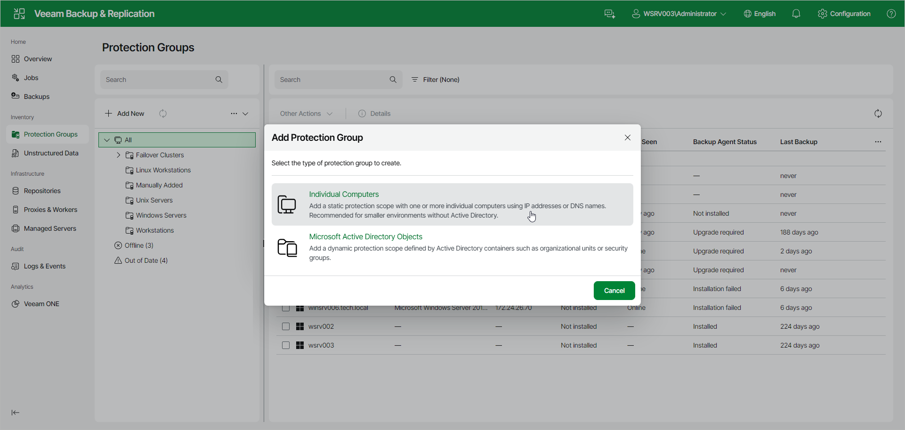

# Step 1. Launch New Protection Group Wizard

To launch the Add Protection Group wizard in the Veeam Backup & ReplicationWeb UI , do the following:

1. In the management pane, click Protection Groups.
2. Click Add New.
3. In the Add Protection Group window, select Individual Computers.

Page updated 2026-07-02

