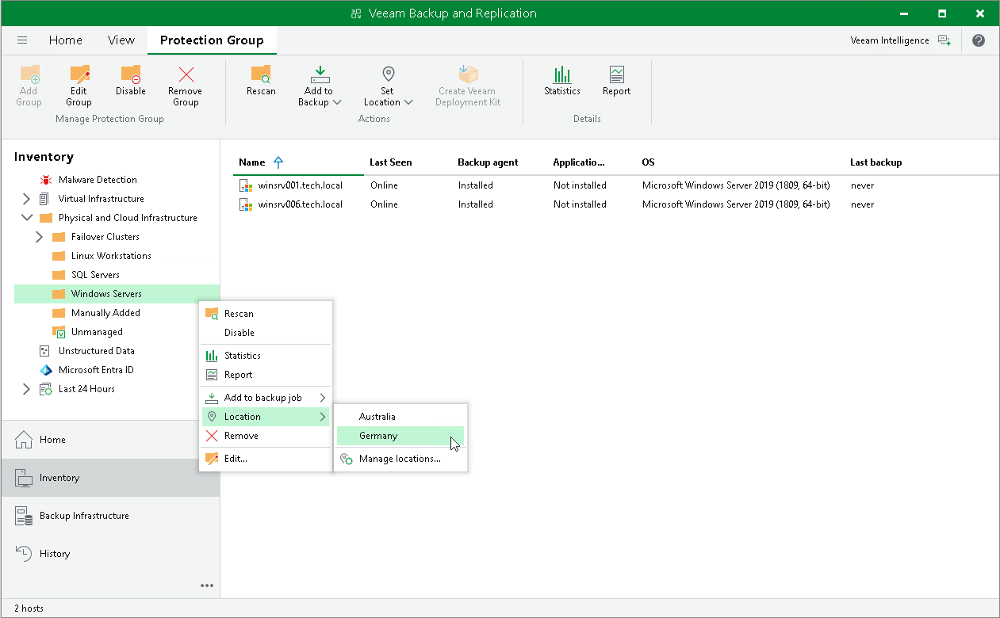

# Assigning Location to Protection Group

You can assign a location to a protection group in the Veeam Backup & Replication console. To assign a location:

1. Open the Inventory view.
2. In the inventory pane, expand the Physical and Cloud Infrastructure node.
3. In the inventory pane, select the necessary protection group and click Location > <Location name> on the ribbon or right-click the necessary protection group and select Location > <Location name>.

To learn more about locations, see [Locations](locations.md).

Page updated 2026-07-03

