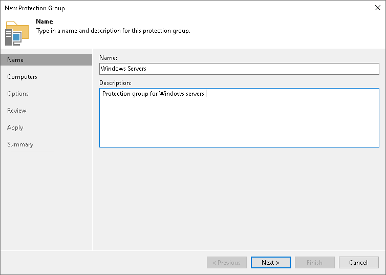

# Step 2. Specify Protection Group Name and Description

At the Name step of the wizard, specify a name and description for the protection group.

1. In the Name field, specify a name for the protection group.
2. In the Description field, provide a description for future reference. The default description contains information about the user who added the protection group, date and time when the protection group was created.

