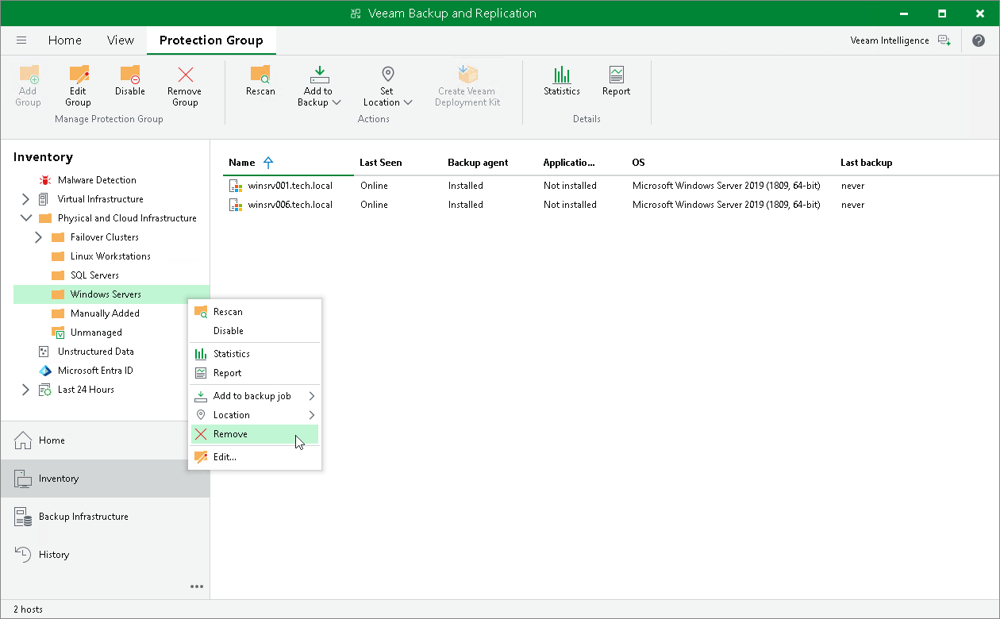
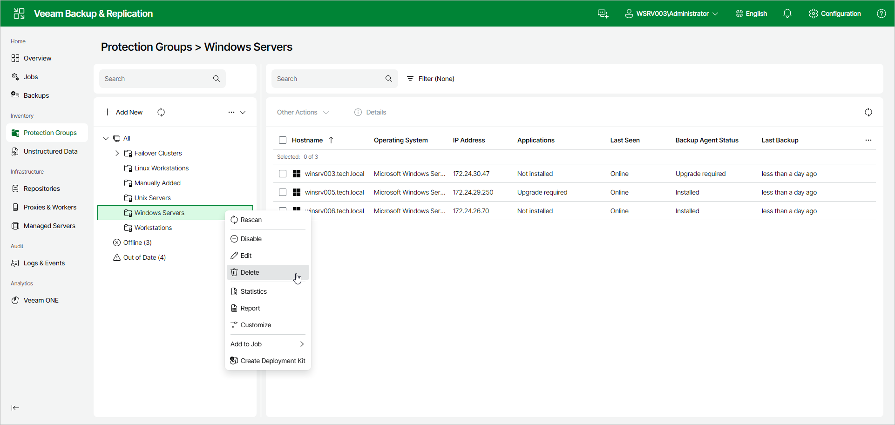

# Removing Protection Group

You can remove a protection group that you configured.

When you remove a protection group, you can instruct Veeam Backup & Replication to remove Veeam Agents from all protected computers included in this protection group, too. The protection group is removed permanently. You cannot undo this operation.

Backups created for computers that were included in the removed protection group remain intact in the backup location. You can delete this backup data manually later if needed.

|  |
| --- |
| NOTE |
| Consider the following:   * You cannot remove a protection group if the entire protection group or a separate computer included in this protection group is added to a Veeam Agent backup job. * You cannot remove default protection groups, such as Manually Added, Unmanaged, and so on. |

|  |
| --- |
| TIP |
| You can also remove separate computers from protection groups. To learn more, see [Removing Computer from Protection Group](agents_protected_computer_remove.md). |

You can remove a protection group in the following ways:

* [Removing Protection Group Using Console](#console)
* [Removing Protection Group Using Web UI](#webui)

Removing Protection Group Using Veeam Backup & Replication Console

To remove a protection group in the Veeam Backup & Replication console:

1. Open the Inventory view.
2. In the inventory pane, expand the Physical and Cloud Infrastructure node.
3. In the inventory pane, select the protection group that you want to remove and click Remove Group on the ribbon or right-click the protection group and select Remove.
4. [Not applicable for protection groups for pre-installed Veeam Agents] If you want to remove Veeam Agent deployed on protected computers, in the displayed window, select the Uninstall everything check box. With this option selected, Veeam Backup & Replication will remove the protection group from the configuration database and, in addition, uninstall Veeam Agent and other Veeam components from every computer in the deleted protection group. Veeam Backup & Replication will remove the same components that can be removed from a specific Veeam Agent computer. To learn more, see [Uninstalling Veeam Agent and Other Veeam Components](agents_protected_computers_remove.md).
5. In the displayed window, click Yes.

Removing Protection Group Using Veeam Backup & Replication Web UI

To remove a protection group in the Veeam Backup & Replication web UI:

1. In the management pane, click Protection Groups.
2. Right-click the protection group that you want to remove, or select the protection group and select Delete from the Other drop-down list.
3. If you want to remove Veeam Agent deployed on protected computers, in the displayed window, select the Uninstall everything check box. With this option selected, Veeam Backup & Replication will remove the protection group from the configuration database and, in addition, uninstall Veeam Agent and other Veeam components from every computer in the deleted protection group. Veeam Backup & Replication will remove the same components that can be removed from a specific Veeam Agent computer. To learn more, see [Uninstalling Veeam Agent and Other Veeam Components](agents_protected_computers_remove.md).
4. In the displayed window, click Yes.

Page updated 2026-07-03

