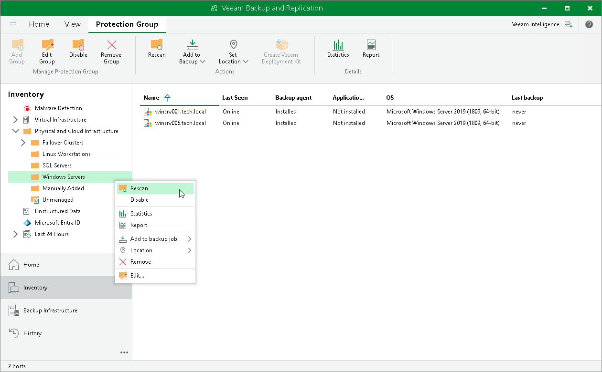

# Rescanning Protection Group

In this article

You can rescan a protection group configured in the inventory. When you perform protection group rescan, you manually start the discovery process for the protection group. This operation may be required, for example, if you want to discover new computers added to the protection group without waiting for the next scheduled start of the rescan job.

|  |
| --- |
|  NOTE |
| You cannot rescan a protection group for pre-installed Veeam Agents. To learn more, see [Protection Group Types](agents_protection_groups_types.md). |

During the rescan operation, Veeam Backup & Replication starts the rescan job in the same way as in case of scheduled discovery. The rescan job connects to computers included in the protection group and performs on these computers operations specified in the protection group settings. For example, if Veeam Backup & Replication is set up to automatically install Veeam Agent on protected computers during discovery, you can use the rescan operation to deploy Veeam Agent to computers that have appeared in the protection group after the previous scheduled rescan job session finished.

To rescan a protection group:

1. Open the Inventory view.
2. In the inventory pane, expand the Physical and Cloud Infrastructure node.
3. In the inventory pane, select the necessary protection group and click Rescan on the ribbon or right-click the protection group and select Rescan.

Page updated 9/1/2025

Page content applies to build 13.0.1.1071
