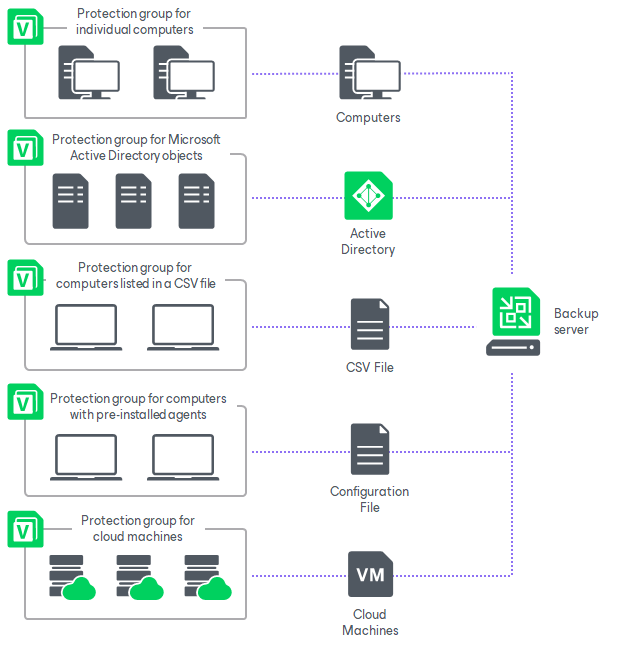

# Protection Group Types

In this article

Veeam Backup & Replication offers several methods to specify computers on which you want to install and manage Veeam Agent. You can create protection groups that include the following types of objects:

* Individual computers

You can organize individual computers into a protection group by specifying the necessary computers in the protection group settings. This option is recommended for smaller environments that do not have Microsoft Active Directory deployed. Veeam Backup & Replication connects to discovered computers using credentials or certificate-based authentication.

* Microsoft Active Directory objects

You can create protection groups that include one or more Microsoft Active Directory objects: entire domain, container, organizational unit, group, computer, or failover cluster. This allows you to manage Veeam Agents on computers being part of an Active Directory domain. Protection groups that include Active Directory domain, containers, groups or organizational units are dynamic in their nature. For example, if a new computer is added to a container, Veeam Backup & Replication will automatically discover this computer and start managing this computer as specified in the protection group settings.

You can specify a protection scope based on Active Directory objects in one of the following ways:

* You can select individual Active Directory objects that you want to include in a protection group, for example, selected organizational units or computers.
* You can include in the protection group an entire domain or other Active Directory object (such as a container or organizational unit) and exclude specific child objects being part of this object, for example, selected organizational units or computers.

* Computers listed in a CSV file

You can add multiple computers to a protection group by importing a list of computers from a CSV or TXT file. Protection groups that include computers listed in a CSV file are also dynamic. If a new computer appears in the file after the protection group is created, during the next protection group rescan session, Veeam Backup & Replication will automatically update the protection group settings to include the added computer.

* Computers with pre-installed backup agents

You can create protection groups for pre-installed Veeam Agents. Protection groups for pre-installed Veeam Agents are empty just after they are created. You must deploy Veeam Agents on computers and configure Veeam Agents to connect to the Veeam backup server. After deployment and configuration, computers become members of the protection group.

This option is recommended if you do not have the full list of computers that you want to protect when you create the protection group. This option also provides a convenient way to install agents using third-party software distribution solutions, when deploying them from the Veeam backup server is not possible due to security and network connectivity restrictions.

* Cloud machines

You can create protection groups to manage Veeam Agents installed on Amazon EC2 instances or Microsoft Azure virtual machines (both objects can be also referred to as cloud machines). This protection group allows you to discover cloud machines and deploy Veeam Agents using cloud native API instead of the connection over network. Cloud machines that run Microsoft Windows or Linux OSes are supported.

This option is useful if you have cloud machines that run VSS-aware applications in your infrastructure and you want to create transactionally consistent backups of applications on these cloud machines.

|  |
| --- |
| IMPORTANT |
| The current guide does not cover subjects related to protection groups that include applications. To learn about this protection group type, see [MongoDB Backup](mongo_protection_group_hiw.md). |

Page updated 9/22/2025

Page content applies to build 13.0.1.1071
