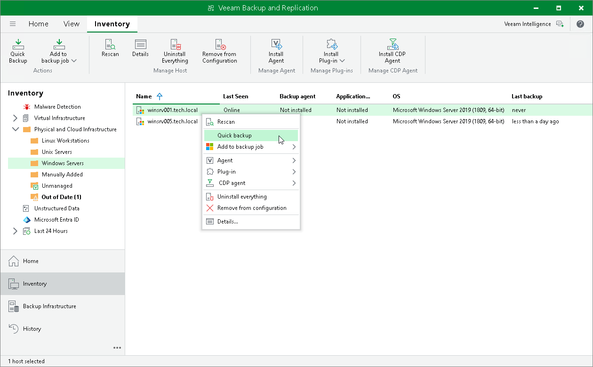

# Performing Quick Backup

In this article

You can create an ad-hoc incremental backup for one or more protected computers — quick backup, and add it to the backup chain on the backup repository. Quick backup can be helpful if you want to produce an additional restore point for one or more computers in the Veeam Agent backup job and do not want to configure a new job or modify the existing one.

Quick backup can be performed for computers that meet the following requirements:

* A protected computer is added to a Veeam Agent backup job managed by the backup server.

* A full backup file for the protected computer exists on the backup repository configured in the backup infrastructure and is mapped to a backup job managed by the backup server.

To perform quick backup:

1. Open the Inventory view.
2. In the inventory pane, expand the Physical and Cloud Infrastructure node and select a protection group that contains the protected computer that you want to back up.
3. In the working area, select one or more computers and click Quick Backup on the ribbon or right-click the computers and select Quick backup.

Veeam Backup & Replication will trigger a Veeam Agent backup job to create a new incremental restore point for selected computers. Details of a running quick backup task are displayed in the job session window.

|  |
| --- |
| NOTE |
| If a computer for which you want to perform quick backup is added to more than one Veeam Agent backup job, Veeam Backup & Replication will trigger only the job that created the latest restore point for this computer. |

Page updated 9/2/2025

Page content applies to build 13.0.1.1071
