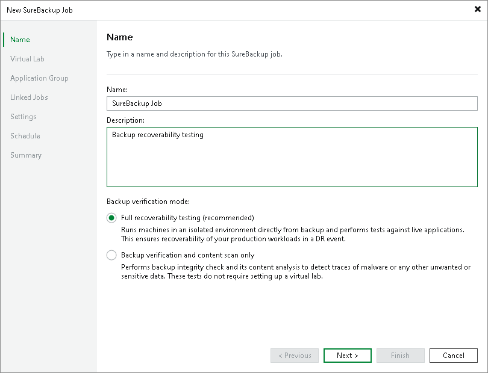

# Recovery Verification for Veeam Agent Backups

In this article

Veeam Backup & Replication offers the SureBackup technology to test backups and check if you can recover data from them. You can verify any restore point of a backed-up computer protected with Veeam Agent for Microsoft Windows and Veeam Agent for Linux.

To learn more about the logic behind SureBackup, see [How SureBackup Works](surebackup_hiw.md).

Before creating the SureBackup job, check limitations for Veeam Agent backups below. Then learn how to prepare your backup infrastructure and create a SureBackup job in [Using SureBackup Job](recovery_verification_surebackup_job.md#create_job).

General Limitations

For backups created with Veeam Agent, SureBackup has the following limitations:

* SureBackup is not supported for backup files created by backup copy jobs.

* SureBackup is not supported for backups stored in the Veeam Cloud Connect repository.
* SureBackup is not supported for backups stored in the archive tier of the the scale-out backup repository.

* For backups created with Veeam Agents, you cannot exclude objects from the scope of the SureBackup job at the Linked Jobs step of the New SureBackup Job wizard.

* [For full recoverability testing mode] SureBackup is not supported for backups containing drives greater than 64 TB.
* [For full recoverability testing mode] If you plan to verify computer recovery with VMware vSphere, consider the following:

* SureBackup is not supported for backups of 4 KB sector drives.
* SureBackup is not supported for backups of storage spaces.
* SureBackup is not supported for backups containing more than 54 drives.

* [For full recoverability testing mode] When Veeam Backup & Replication publishes virtual machines based on backed-up Veeam Agent computers in the isolated virtual environment, all these virtual machines are included in the first isolated network added during the virtual lab configuration. To learn more, see [Create Isolated Networks](vlab_isolated_network_vm.md).

Limitations for Backups Created with Veeam Agent for Microsoft Windows

For backups created with Veeam Agent for Microsoft Windows, SureBackup has the following limitations:

* SureBackup is not supported for failover clusters.

* [For full recoverability testing mode] SureBackup is not supported for file-level backups. You must use entire machine or volume-level backup of the protected computer.

* [For full recoverability testing mode] SureBackup is not supported if the Microsoft Windows system partition and boot partition of the backed-up computer are located on different drives.

Limitations for Backups Created with Veeam Agent for Linux

For backups created with Veeam Agent for Linux, SureBackup has the following limitations:

* [For full recoverability testing mode] You cannot use SureBackup with backup files created with Veeam Agent for Linux on Power.

* The successful recovery verification is not guaranteed for the following Linux distributions:

* Amazon Linux 2
* Amazon Linux 2023

* The successful recovery verification is not guaranteed for backups of Linux-based systems that contain encrypted devices.
* If you want Veeam Backup & Replication to connect the recovered VM to the virtual network, one of the following configuration utilities must be installed on the protected computer:

* Netplan
* NetworkManager
* sysconfig
* systemd-networkd
* ifupdown/ifupdown2

* SureBackup is not supported for file-level backups. You must use volume-level backup of the protected computer. The backup must include the root file system (/) and all partitions specified in the /etc/fstab file.

Page updated 5/23/2025

Page content applies to build 13.0.1.1071
