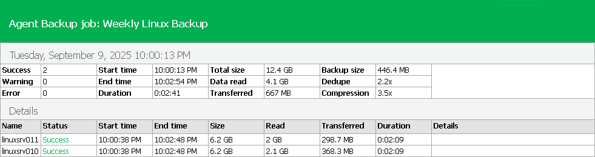

# Viewing Veeam Agent Backup Job Report

You can generate a report with details about Veeam Agent backup job session performance. The report contains data on the latest backup job session initiated for the job. To generate a report:

1. Open the Home view.
2. In the inventory pane, click the Jobs node.
3. Depending on the backup job settings, do the following:

* If the backup job does not back up Microsoft SQL Server transaction logs, in the working area, select the necessary job and click Report on the ribbon or right-click the job and select Report.
* If the backup job backs up Microsoft SQL Server transaction logs, in the working area, select the necessary job and click Report > Instance Backup on the ribbon or right-click the job and select Report > Instance Backup.

For more information about backup of Microsoft SQL Server transaction logs, see [Microsoft SQL Server Transaction Log Settings](agent_job_vss_sql.md).

The report contains data on the latest job session:

* Cumulative session statistics: session duration details, details of the session performance, amount of read, processed and transferred data, backup size, compression and deduplication ratios.
* Detailed statistics for every protected computer processed within the session: processing duration details, backup data size, amount of read and transferred data, list of warnings and errors (if any).

|  |
| --- |
| TIP |
| Consider the following:   * You can also set up Veeam Backup & Replication to send reports automatically by email. To learn more, see [Enabling Email Reporting](agents_reporting_email.md). * You can generate a separate report with details about SQL transaction log backup. To learn more, see [Viewing SQL Transaction Log Backup Report](agents_reporting_logs_report.md). |

