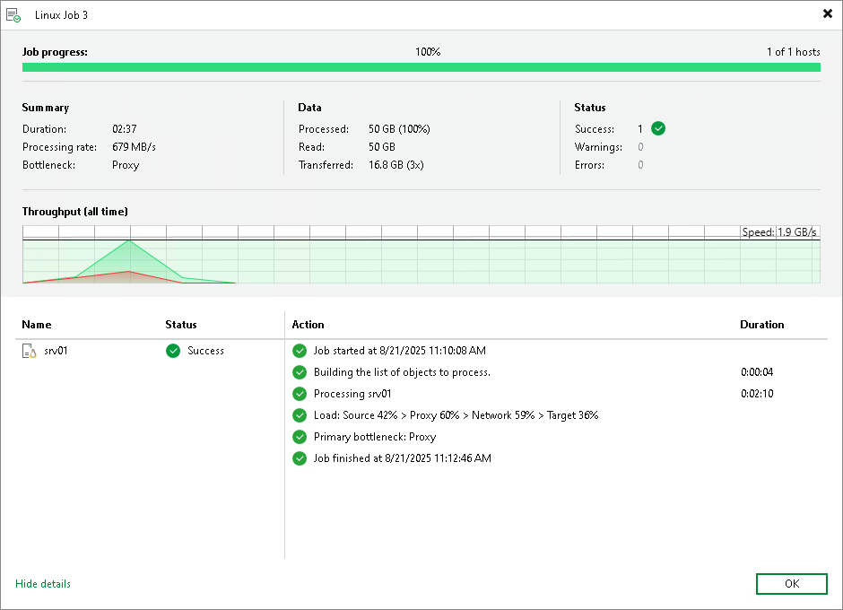

# Viewing Veeam Agent Backup Job Statistics

In this article

You can view statistics about Veeam Agent backup jobs configured in Veeam Backup & Replication. For Veeam Agent backup jobs managed by the backup server, Veeam Backup & Replication displays statistics in the similar way as for backup jobs for VM data backup.

To learn more, see [Reporting](reporting.md).

To view Veeam Agent backup job statistics:

1. Open the Home view.
2. In the inventory pane, click the Jobs node.
3. Depending on the backup job settings, do the following:

* If the backup job does not back up Microsoft SQL Server transaction logs, in the working area, select the necessary job and click Statistics on the ribbon or right-click the job and select Statistics.
* If the backup job backs up Microsoft SQL Server transaction logs, in the working area, select the necessary job and click Statistics > Instance Backup on the ribbon or right-click the job and select Statistics > Instance Backup.

For more information about backup of Microsoft SQL Server transaction logs, see [Microsoft SQL Server Transaction Log Settings](agent_job_vss_sql.md).

Page updated 9/2/2025

Page content applies to build 13.0.1.1071
