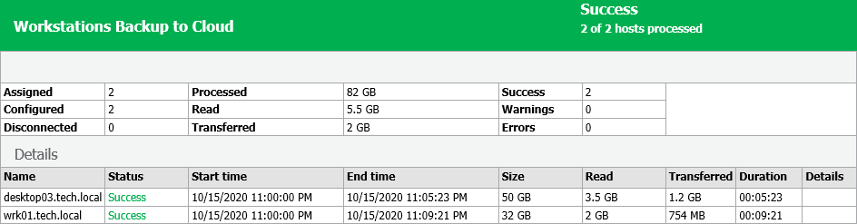

# Viewing Backup Policy Report

You can generate a report with details about Veeam Agent backup job sessions performed on protected computers added to a backup policy. The report contains data on the latest backup job session initiated for the backup policy. To generate a report:

1. Open the Home view.
2. In the inventory pane, click the Jobs node.
3. Depending on the backup policy settings, do the following:

* If the backup policy does not back up Microsoft SQL Server transaction logs, in the working area, select the necessary policy and click Report on the ribbon or right-click the policy and select Report.
* If the backup policy backs up Microsoft SQL Server transaction logs, in the working area, select the necessary policy and click Report > Instance Backup on the ribbon or right-click the policy and select Report > Instance Backup.

For more information about backup of Microsoft SQL Server transaction logs, see [Microsoft SQL Server Transaction Log Settings](agent_policy_win_vss_sql.md).

The report contains data on the latest job session:

* Cumulative session statistics: details on the number of protected computers specified in the backup policy settings, the number of computers to which settings of the backup policy are applied, and the number of disconnected computes, details of the session performance, amount of read, processed and transferred data.
* Detailed statistics for every protected computer processed within the session: processing duration details, backup data size, amount of read and transferred data, list of warnings and errors (if any).

* Detailed statistics for the application process if you edit the backup policy. In this case Veeam Backup & Replication applies the backup policy to protected computers and includes information about this process in the next job session report.

|  |
| --- |
| TIP |
| Consider the following:   * You can also set up Veeam Backup & Replication to send reports automatically by email. To learn more, see [Enabling Email Reporting](agents_reporting_email.md).  * You can generate a separate report with details about SQL transaction log backup. To learn more, see [Viewing SQL Transaction Log Backup Report](agents_reporting_logs_report.md). |

