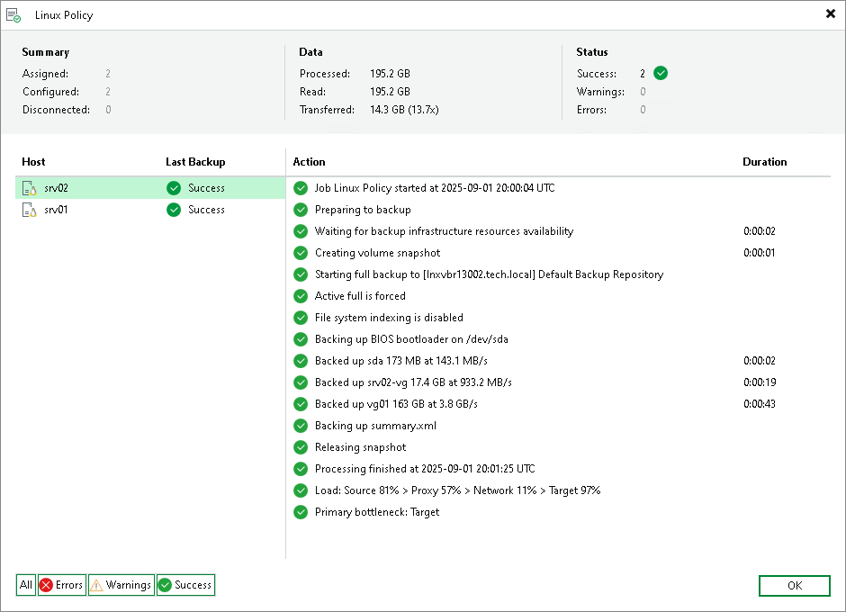

# Viewing Backup Policy Statistics

You can view statistics about Veeam Agent backup jobs configured in Veeam Backup & Replication. For Veeam Agent backup jobs managed by Veeam Agent, or backup policies, Veeam Backup & Replication displays statistics in the following way:

* After you create a backup policy, Veeam Backup & Replication applies the backup policy to protected computers. In the policy statistics window, Veeam Backup & Replication displays information about policy application process and results. This information remains in the policy statistics window until the first Veeam Agent backup job session is performed on computers included in the backup policy.
* After the Veeam Agent backup job session statistics becomes available in Veeam Backup & Replication, this statistics appears in the policy statistics window. The job session statistics becomes available in Veeam Backup & Replication at a different time depending on what target for backup files is selected in the backup policy settings:

* If a Veeam Agent backup job whose settings are defined by the backup policy creates backup files on a Veeam backup repository, backup job session statistics is available in Veeam Backup & Replication on real-time basis.
* If a Veeam Agent backup job creates backup files on a local drive of a Veeam Agent computer, in a network shared folder, in a Veeam Cloud Connect repository, or in object storage using the direct connection mode, backup job session results are not passed to Veeam Backup & Replication in real time. Statistics for such backup sessions becomes available in Veeam Backup & Replication later, after rescan of a protection group that contains computers added to the backup policy. This process happens regularly upon the discovery schedule defined in the protection group settings, or every 24 hours — for protection groups for pre-installed Veeam Agents.

* Veeam Backup & Replication regularly applies the backup policy to protected computers. This operation is performed during automatic rescan of a protection group that contains computers added to the backup policy. If the application process completes with a warning or an error, Veeam Backup & Replication displays information about the application process results in the policy statistics window. Information about successful application of the backup policy is not displayed in the statistics window between two backup sessions.

Veeam Backup & Replication displays statistics for backup policies in a different way than for Veeam Agent backup jobs managed by the backup server. The main differences are the following:

* For backup policies, Veeam Backup & Replication does not display the job progress bar. You can monitor backup progress only for individual computers in the backup policy.
* Detailed statistics include the number of Veeam Agent computers specified in the backup policy settings, the number of computers to which settings of the backup policy are applied, and the number of computes that have no connection to the backup server at the time when the Veeam Agent backup job is performed.
* You can use the Errors, Warnings and Success buttons at the bottom of the job statistics window to view details on operations that failed, completed with a warning or completed successfully during a Veeam Agent job session performance.

|  |
| --- |
| TIP |
| In addition to backup policy statistics, Veeam Backup & Replication displays individual backup session statistics for each computer in the backup policy. You can view these statistics in the History view of the Veeam backup console. |

To view Veeam Agent backup policy statistics:

1. Open the Home view.
2. In the inventory pane, click the Jobs node.
3. Depending on the backup policy settings, do the following:

* If the backup policy does not back up Microsoft SQL Server transaction logs, in the working area, select the necessary policy and click Statistics on the ribbon or right-click the policy and select Statistics.
* If the backup policy backs up Microsoft SQL Server transaction logs, in the working area, select the necessary policy and click Statistics > Instance Backup on the ribbon or right-click the policy and select Statistics > Instance Backup.

For more information about backup of Microsoft SQL Server transaction logs, see [Microsoft SQL Server Transaction Log Settings](agent_policy_win_vss_sql.md).

