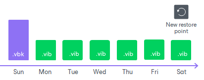
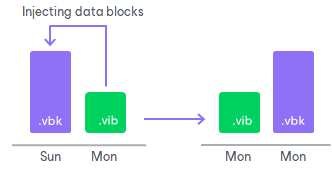
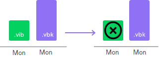
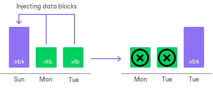

# Short-Term Retention Policy

In this article

Restore points in the backup chain are not kept forever. The short-term retention policy defines when a restore point is obsolete and must be removed from the backup chain so that backup files do not consume too much disk space.

Depending on the selected job mode, restore points are handled by Veeam Backup & Replication or Veeam Agent. To learn more, see [Veeam Agent Backup Jobs and Policies](agents_job_mode.md).

Veeam Backup & Replication or Veeam Agent retains restore points in the following way:

* For Veeam Agent backup jobs managed by the backup server and Veeam Agent backup jobs managed by Veeam Agent for Linux, Veeam Agent for Mac or Veeam Agent for Unix, Veeam Backup & Replication or Veeam Agent keeps backup files for the <N>+1 days, where <N> is the number of days that you specified in the backup job settings.

|  |
| --- |
| NOTE |
| The minimum number of retained restore points is 3, and this number does not depend on the number of days set in the backup job settings. You can change the minimum number of retained restore points with a registry value. To learn more, contact [Veeam Customer Support](https://www.veeam.com/support.html). |

* For Veeam Agent backup jobs managed by Veeam Agent for Microsoft Windows, Veeam Agent takes into account only days on which backup files were successfully created. Veeam Agent ignores restore points created on the day when the retention policy is applied and keeps restore points for the <N> + 1 days, where <N> is the number of days that you specified in the backup job settings.

Removing Backups by Retention

When the obsolete restore points are removed by retention, Veeam Backup & Replication or Veeam Agent transforms the backup chain so it always contains a full backup file on which subsequent incremental backup files are dependent. To do so, Veeam Backup & Replication or Veeam Agent uses the following rotation scheme:

1. During every backup job session Veeam Backup & Replication or Veeam Agent adds a backup file to the backup chain and checks if there is an obsolete restore point.

1. If an obsolete restore point exists, Veeam Backup & Replication or Veeam Agent transforms the backup chain. As part of this process, it performs the following operations:

1. Rebuilds the full backup file to include in it data of the incremental backup file that follows the full backup file. To do this, Veeam Backup & Replication or Veeam Agent injects into the full backup file data blocks from the earliest incremental backup file in the chain. This way, a full backup ‘moves’ forward in the backup chain.

1. Removes the earliest incremental backup file from the chain as redundant: its data has already been injected into the full backup file, and the full backup file includes data of this incremental backup file.

If the backup chain contains several obsolete restore points, the rebuild procedure is similar. Data from several restore points is injected to the rebuilt full backup file. This way, Veeam Backup & Replication or Veeam Agent makes sure that the backup chain is not broken, and you will be able to recover your data to any restore point.

Page updated 8/7/2025

Page content applies to build 13.0.1.1071
