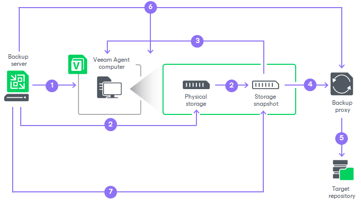

# Backup from Storage Snapshots

To create a backup from a storage snapshot, Veeam Backup & Replication and Veeam Agent do the following:

1. Veeam Backup & Replication checks that the hardware VSS provider is installed on the Veeam Agent computer.

If the hardware VSS provider is not installed, Veeam Backup & Replication rescans the Veeam Agent computer and installs the hardware VSS provider.

1. Veeam Backup & Replication starts a backup job session and sends a request to the storage system to create a native snapshot as a new LUN.

The hardware VSS provider aborts the shadow copy creation if the whole process takes longer than 60 seconds or if the provider takes longer than 10 seconds to commit the shadow copy. To meet these time limits, Veeam Agent expects the storage system to create a snapshot within 9 seconds. In case of a standalone server, Veeam Agent can extend this period up to 59 seconds. In case of a failover cluster, Veeam Agent cannot extend the 9-second period. To learn more on how the hardware VSS provider creates shadow copies, see [Microsoft documentation](https://learn.microsoft.com/en-us/windows/win32/vss/shadow-copy-creation-for-providers).

If storage system fails to create a native snapshot within the time period allowed by VSS, Veeam Backup & Replication will behave according to the [storage integration settings](agent_job_advanced_integration.md). Veeam Backup & Replication will complete the backup job with the Failed status or fail over to the regular backup scenario that uses software VSS provider.

1. After a snapshot LUN is created, this LUN connects to Veeam Agent computer to finish VSS operations and record storage metadata.
2. Veeam Backup & Replication mounts the snapshot LUN to the backup proxy.
3. Veeam Backup & Replication reads the snapshot LUN and transfers data from the backup proxy to the target repository.

Keep in mind that if the snapshot LUN contains a dynamic volume, Veeam Backup & Replication reads all extents of this volume.

1. Veeam Backup & Replication completes backup operations on the Veeam Agent computer and the backup proxy.
2. Veeam Backup & Replication removes the snapshot LUN from storage.

After that, you can use backups created from storage snapshots for restore and administration tasks. For such Veeam Agent backups, Veeam Backup & Replication allows you to perform the same set of operations as for backups created with regular backup scenario that uses software VSS provider. To learn more, see [Restoring Data from Veeam Agent Backups](performing_restore_tasks.md) and [Managing Veeam Agent Backups](agent_backup_manage.md)

