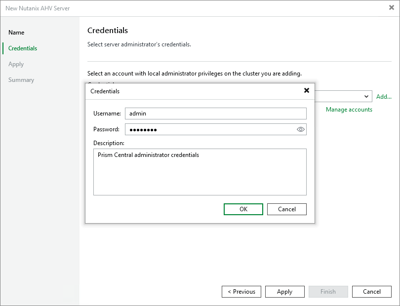

# Step 3. Specify Credentials

At the Credentials step of the wizard, specify credentials for an administrator account with the Prism Admin role that is used to access the cluster or Prism Central. For more information on Nutanix AHV system administrator roles, see [Nutanix documentation](https://portal.nutanix.com/page/documents/details?targetId=Nutanix-Security-Guide-v7_3:ssp-ssp-role-based-access-control-pc-c.html).

For credentials to be displayed in the Credentials list, they must be added to the Credentials Manager as described in section [Standard Accounts](credentials_manager_windows.md). If you have not added the necessary credentials to the Credentials Manager beforehand, you can do this without closing the New Nutanix AHV Sever wizard. To add an account, do the following:

1. Click Add.
2. In the Credentials window, specify a user name and password for the account.

1. Click OK.

The backup server will connect to the cluster or Prism Central and check its TLS certificate. If the certificate is not trusted, the Certificate Security Alert Window will display a warning notifying that secure communication cannot be guaranteed. To allow the backup server to connect to the cluster or Prism Central using the certificate, click Continue.

