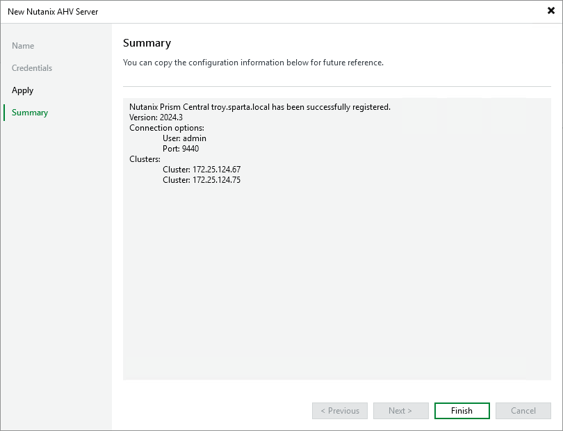

# Step 5 Finish Working with Wizard

At the Summary step of the wizard, check that the server has been successfully added and click Finish.

|  |
| --- |
| Tip |
| You can review details of the cluster or Prism Central registration session in system logs as described in section [Viewing History Statistics](history_statistics.md). |

After you complete the wizard, it is required that you configure at least one worker. You can proceed to the New Enter value Worker wizard immediately, or launch the wizard later as described in section [Managing Workers](ahv_workers.md).

