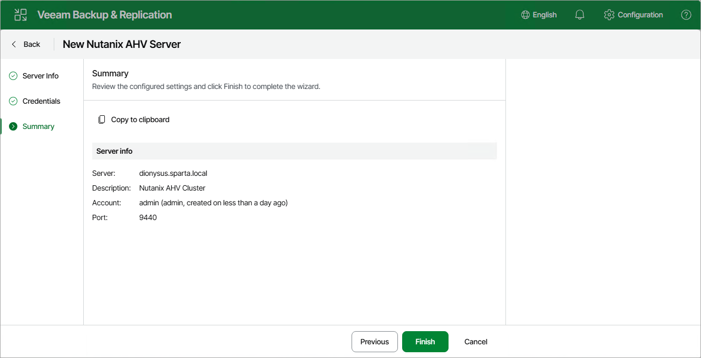

# Step 4. Finish Working with Wizard

At the Summary step of the wizard, check that the cluster or Prism Central has been successfully added and click Finish.

|  |
| --- |
| Tip |
| You can review details of the cluster or Prism Central registration session in system logs as described in section [Viewing Logs and Events](history_statistics_web.md). |

After you complete the wizard, it is required that you configure at least one worker. To launch the wizard, follow the instructions described in section [Managing Workers](ahv_workers.md).

Page updated 2026-07-07

