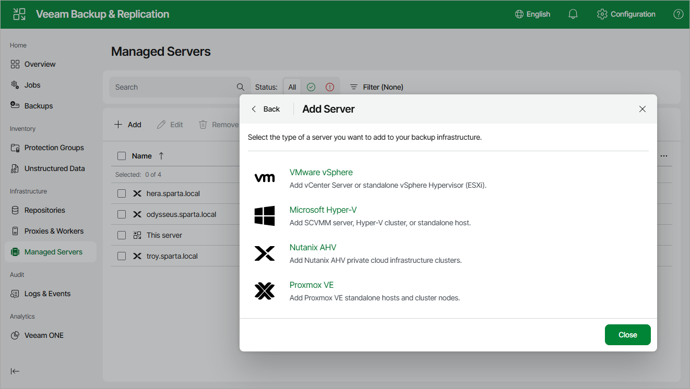

# Step 1. Launch New Nutanix AHV Server Wizard

To launch the New Nutanix AHV Server wizard, do the following:

1. Navigate to Managed Servers and click Add.
2. Select Virtualization Platforms > Nutanix AHV.

Page updated 2026-07-07

