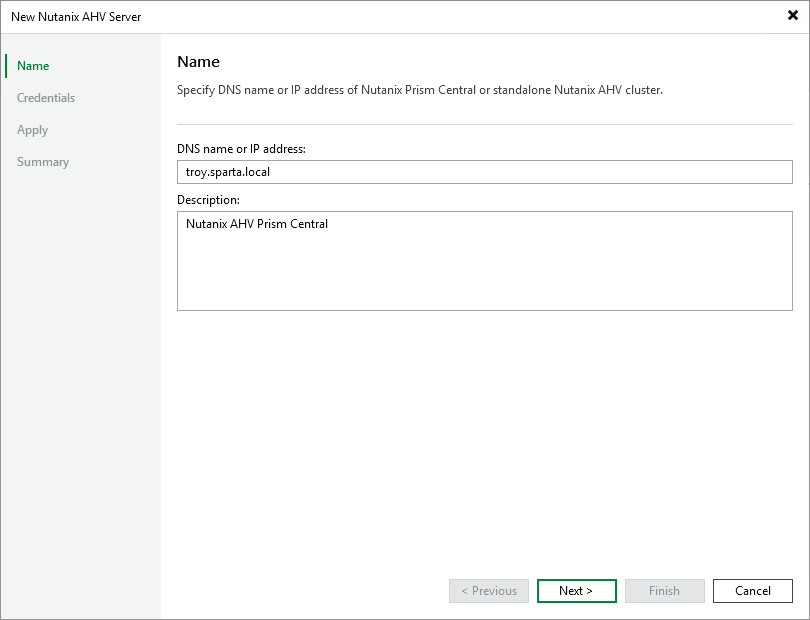

# Step 2. Specify Server Domain Name or Address

At the Name step of the wizard, do the following:

1. In the DNS name or IP address field, enter the FQDN or IP address of the Nutanix AHV standalone cluster or Prism Central.
2. In the Description field, provide a description for future reference. The field already contains a default description with information about the user who added the cluster or Prism Central, date and time when it was added.

