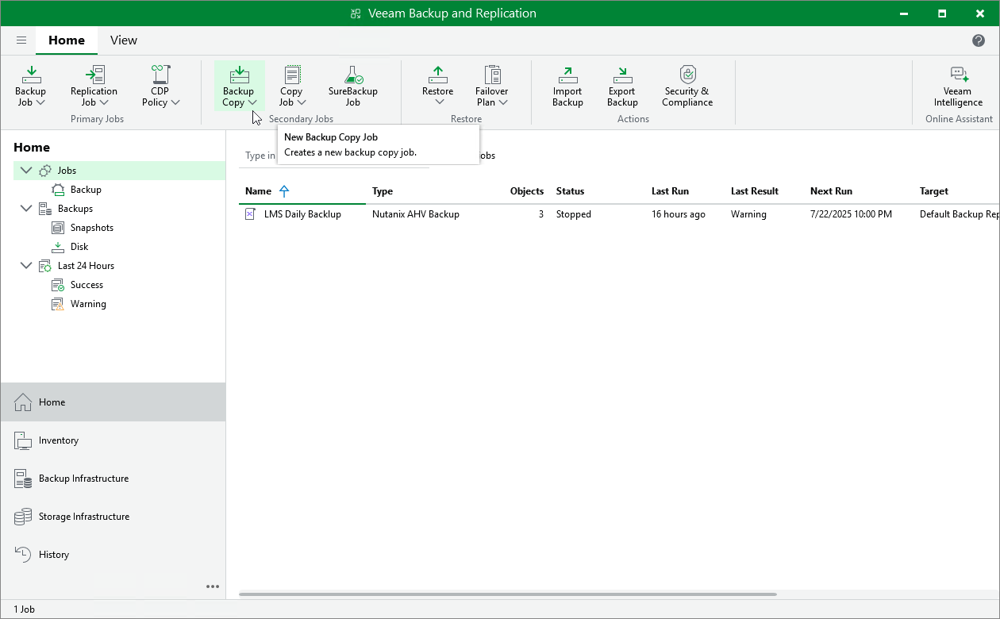

# Copying Backups

With backup copy, you can create several instances of a backup and copy them to secondary (target) backup repositories for long-term storage. Target backup repositories can be located in the same site as the source backup repository or can be deployed off-site. Since the backup copy has the same format as the original backup, you can restore VM data directly from the backup copy in case a disaster strikes. For more information on the backup copy functionality, see [Backup Copy](backup_copy.md).

To copy backups to a secondary backup repository, do the following:

1. In the Veeam Backup & Replication console, open the Home view.
2. In the inventory pane, select Jobs > Backup and click Backup Copy > Image-level backup on the ribbon.
3. Create a backup copy job as described in section [Creating Backup Copy Jobs](backup_copy_create.md).

Note that for backup copies, you can also use [Veeam Cloud Connect repositories](https://helpcenter.veeam.com/docs/vbr/cloud/cloud_connect_repository.html?ver=13) if a service provider is added to Veeam Backup & Replication.

|  |
| --- |
| NotE |
| Veeam Plug-in for Nutanix AHV copies all backups produced by a source backup job — you cannot select backups of specific VMs. |

Alternatively, you can create a copy of a backup without configuring a job as described in section [Copying Backups](copy_backup.md).

