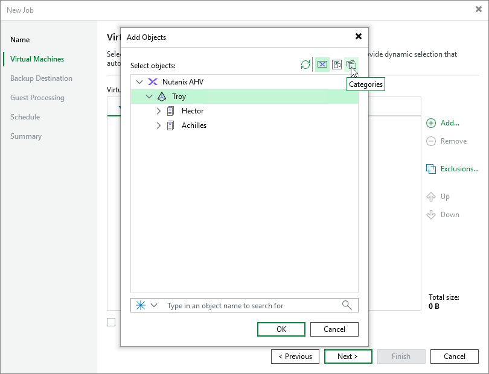
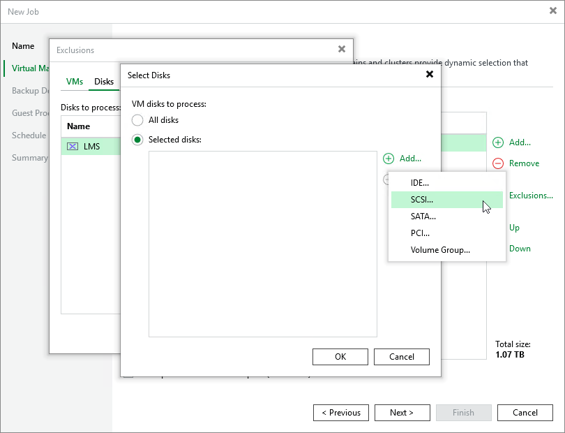

# Step 3. Configure Backup Source Settings

At the Virtual Machines step of the wizard, specify the backup scope — resources that Veeam Backup & Replication will back up.

Step 3a. Choose Virtual Machines

Specify VMs that will be included into the backup scope:

1. Click Add.
2. In the Add Objects window, choose whether you want to back up all VMs in the cluster, only specific VMs or protection domains. In the [Prism Central deployment](ahv_infrastructure_prism_central.md), you can also back up VMs and clusters assigned to a specific category or all VMs managed by a Prism Central.

To view the list of available protection domains, click the PDs icon on the toolbar at the top right corner of the window. If you add a protection domain, Veeam Backup & Replication will regularly check for new consistency groups (VMs and volume groups) added to the domain and automatically update the job settings to include these groups in the backup scope. For a protection domain to be displayed in the list of the available domains, it must be configured in the Nutanix AHV cluster as described in [Nutanix documentation](https://portal.nutanix.com/page/documents/details?targetId=Prism-Element-Data-Protection-Guide-v7_3:wc-protection-domain-wc-t.html).

To view the list of available categories, click the Categories icon on the toolbar at the top right corner of the window. If you add a category, Veeam Backup & Replication will regularly check for new VMs and clusters assigned to the category and automatically update the job settings to include these resources in the backup scope. For a category to be displayed in the list of the available categories, it must be configured in the Nutanix AHV Prism Central as described in [Nutanix documentation](https://portal.nutanix.com/page/documents/details?targetId=Prism-Central-Admin-Center-Guide-vpc_7_3:ssp-ssp-categories-manage-pc-c.html).

|  |
| --- |
| Tip |
| As an alternative to specifying resources explicitly, you can exclude a number of resources from the backup scope. To do that, click Exclusions and specify the VMs, protection domains, cluster or categories that you do not want to back up — the procedure is the same as described for including resources in the backup scope.  Consider that if a resource appears both in the list of included and excluded resources, Veeam Backup & Replication will still not process the resource because the list of excluded resources has a higher priority. |

While running the job, Veeam Backup & Replication processes resources in the order they are added to the backup scope. However, you can change the order, for example, if you add some mission-critical VMs to the job and want them to be processed first. To change the processing order, select a resource and use the Up or Down buttons.

|  |
| --- |
| Note |
| Consider the following:   * If you include a resource into the backup scope for multiple times (for example, an individual VM and a PD that contains this VM), Veeam Backup & Replication will process this resource only once.  * If you include a protection domain, category, cluster or Prism Central into the backup scope, VMs in this object are processed at random. To ensure that the VMs are processed in a specific order, you must add them as standalone VMs — not as a part of the protection domain, category, cluster or Prism Central. |

[Applies only to the [Prism Central deployment](ahv_infrastructure_prism_central.md)] To instruct Veeam Backup & Replication to [obtain VM data from a replica cluster](ahv_nutanix_snapshots.md), select the Backup from Prism Central replica (if available) check box. Using replica clusters help you reduce impact of backup operations on performance of the production environment. If Veeam Backup & Replication fails to obtain data from a replica cluster, backup will be still performed using VM data obtained from the main cluster.

Step 3b. Choose Disks and Volume Groups

By default, jobs process all disks and volume groups attached to VMs included into the backup scope. However, you can instruct Veeam Backup & Replication to back up only specific virtual disks and volume groups related to the selected backup scope:

1. Click Exclusions.
2. In the Exclusions window, switch to the Disks tab and click Add.
3. In the Add Objects window, select a resource that you have added to the backup scope and click OK.
4. Back to the Exclusions window, select the resource and click Edit.
5. In the Select Disks window, select the Selected Disks option, click Add and choose a bus type of the disks that you want to back up. Then, select the necessary disks.

Disks that you do not select will be excluded from the backup job.

|  |
| --- |
| Note |
| If you configure multiple disk protection rules, specific rules will override general ones. For example, if you add a rule for a protection domain and for a VM included in this domain, Veeam Backup & Replication will process the VM disks according to the rule configured for the VM. |

Related Topics

[Snapshot Types](ahv_nutanix_snapshots.md)

