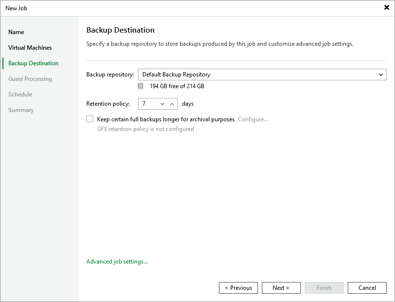

# Step 4. Configure Backup Destination Settings

At the Backup Destination step of the wizard, do the following:

1. From the Backup repository drop-down list, select a backup repository where you want to store backups.

For a backup repository to be displayed in the list of the available repositories, it must be [added to the backup infrastructure](ahv_configure_repository.md).

1. In the Retention policy section, choose how long Veeam Backup & Replication will keep restore points in a backup chain. If a restore point is older than the specified limit, Veeam Backup & Replication will remove it from the chain. For more information on how Veeam Backup & Replication tracks and removes redundant restore points, see [Retention Policies](ahv_retention_policy.md).

Keep in mind that since every backup chain must contain at least 3 restore points, Veeam Backup & Replication may ignore the configured retention policy settings and retain restore points for longer periods of time. For more information, see [Backup Retention](ahv_retention_backups.md).

|  |
| --- |
| Note |
| If the UUID of a VM changes (for example, if the VM migrates to another cluster), Veeam Backup & Replication will be unable to continue the backup chain for this VM. After you re-add the VM to the backup job, Veeam Backup & Replication will start a new backup chain for it. However, you will still be able to perform restore operations using backups from the old backup chain. |

To help you implement a comprehensive backup strategy, Veeam Backup & Replication allows you to [enable long-term retention policy for backups](ahv_backup_job_vbr_gfs.md) and to [configure backup job advanced settings](ahv_backup_job_vbr_advanced.md) (for example, enable health check, schedule full backups, plan backup maintenance and customize email notifications).

