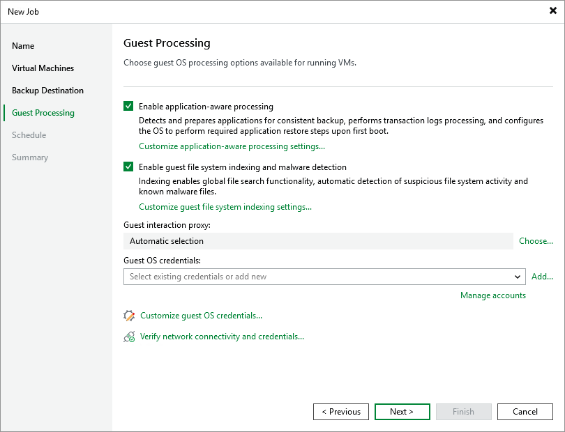

# Step 5. Specify Guest Processing Options

At the Guest Processing step of the wizard, you can specify the following settings:

* [Enable application-aware processing](ahv_backup_job_vbr_vss_application.md) — to create transactionally consistent backups that will guarantee proper recovery of VM applications, without data loss.

For VMs running Microsoft SQL Server, Oracle Server or PostgreSQL Server applications, you can also instruct Veeam Backup & Replication to periodically back up transaction logs. This will allow you to restore your databases to specific points in time as described in the Veeam Enterprise Manager User Guide, section [Restoring Point-in-Time State](https://helpcenter.veeam.com/docs/vbr/explorers/vesql_restoring_pit.html?ver=13).

* [Enable guest file system indexing and malware detection](ahv_backup_job_vbr_vss_indexing.md) — to create a catalog of guest OS files that will allow you to search for specific items during file-level restore. This will also allow you to receive reports about malware files and suspicious system activity detected on VMs included into the backup scope.
* [Choose guest interaction proxies](ahv_backup_job_vbr_vss_proxy.md) — to select specific servers that Veeam Backup & Replication will use when communicating with guest OSes of VMs included into the backup scope.
* [Manage VM guest OS credentials](ahv_backup_job_vbr_vss_credentials.md) — to specify credentials that Veeam Backup & Replication will use to access guest OSes of all VMs included into the backup scope.

Considerations and Limitations

If you enable application-aware processing or guest files system indexing, consider the following:

* Veeam Plug-in for Nutanix AHV will not be able to [obtain VM data from replica clusters](ahv_backup_job_vbr_assign_vms.md).
* Veeam Plug-in for Nutanix AHV will not be able to [create PD snapshots](ahv_nutanix_snapshots.md#PDsnapshots) of protection domains included into the backup scope — it will back up VMs and their volume groups as if processing individual virtual machines.
* Veeam Plug-in for Nutanix AHV will not be able to [use Kerberos authentication](kerberos_authentication.md) while connecting to guest OSes of the processed VMs.

Related Topics

* [Requirements and limitations for PostgreSQL WAL files backup](postgresql_backup.md)
* [Requirements and limitations for Oracle archived redo logs backup](oracle_backup.md)

