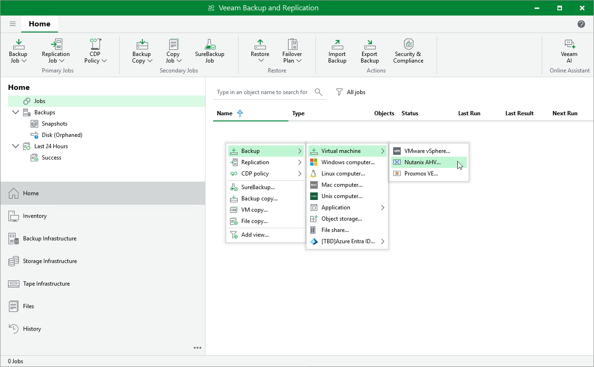

# Step 1. Launch New Job Wizard

To launch the New Job wizard, do the following:

1. Open the Home view.
2. In the inventory pane, select Jobs.

1. Right-click the working area and select Backup > Virtual machine > Nutanix AHV.

Alternatively, click Backup Job > Virtual machine on the ribbon.

