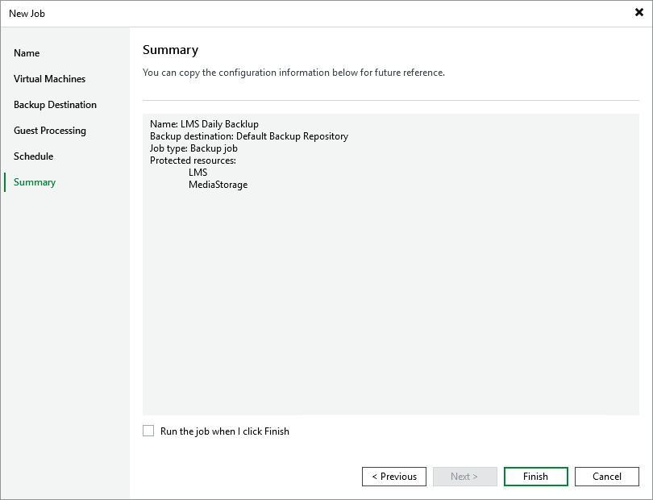

# Step 7. Finish Working with Wizard

At the Summary step of the wizard, review summary information and click Finish. As soon as Veeam Backup & Replication starts the job, the backup progress will be displayed in the working area when you navigate to Jobs > Backups in the inventory pane of the Home view.

|  |
| --- |
| Tip |
| If you want to start the job immediately, select the Run the job when I click Finish check box and then click Finish. |

