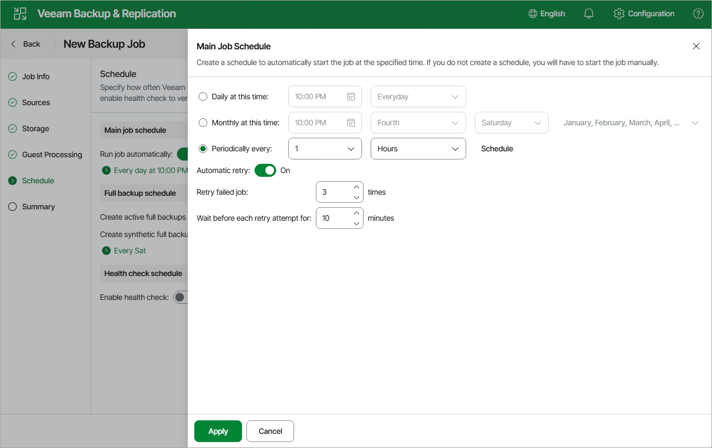

# Step 6. Specify Job Scheduling Options

At the Schedule step of the wizard, you can instruct Veeam Backup & Replication to start the backup job automatically according to a specific backup schedule. The backup schedule defines how often data of the VMs added to the backup job will be backed up.

To help you implement a comprehensive backup strategy, Veeam Backup & Replication allows you to create schedules of the following types:

* Daily — the backup job will run at a specific time on specific days.

To create a daily schedule for the backup job, select the Daily at this time option and define the exact hour when the job will create restore points. Then, use the drop-down list to choose whether you want the backup job to run every day, on weekdays (Monday through Friday) or on specific days.

* Monthly — the backup job will run at a specific time on specific days of specific months.

To create a monthly schedule for the backup job, select the Monthly at this time option and define the exact hour when the job will create restore points. Then, use the drop-down lists to schedule the specific days and months for the backup job to run.

* Periodically — the backup job will run repeatedly throughout a day with a specific time interval.

To create a periodical schedule for the backup job, select the Periodically every option and define the frequency (in hours or minutes) with which the job will create restore points.

Additionally, you can schedule full backups and configure health check settings:

* To [schedule active full backups](ahv_active_full_backup.md), set the Create active full backups periodically toggle to On, click the link below and choose whether you want to create these backups on specific days on a weekly or monthly basis.

Alternatively, you can create active full backups manually when needed. For more information, see [Creating Active Full Backup](ahv_creating_active_full_backup.md).

* To [schedule synthetic full backups](ahv_synthetic_full_backup.md), set the Create synthetic full backups periodically toggle to On, click the link below and choose whether you want to create these backups on specific days on a weekly or monthly basis.

|  |
| --- |
| Important |
| * Synthetic full backups cannot be scheduled if an object storage repository is selected as the target location for backups. * Do not schedule synthetic and active full backups to run at the same time. Due to technical limitations, Veeam Backup & Replication will be unable to create synthetic full backups according to the specified schedule. |

* To instruct Veeam Backup & Replication to periodically [perform a health check](ahv_how_health_check_works.md) for the backups, set the Enable health check toggle in the Health check schedule section to On, click the link below and choose whether you want to perform these checks on specific days on a weekly or monthly basis.

Page updated 2026-07-16

