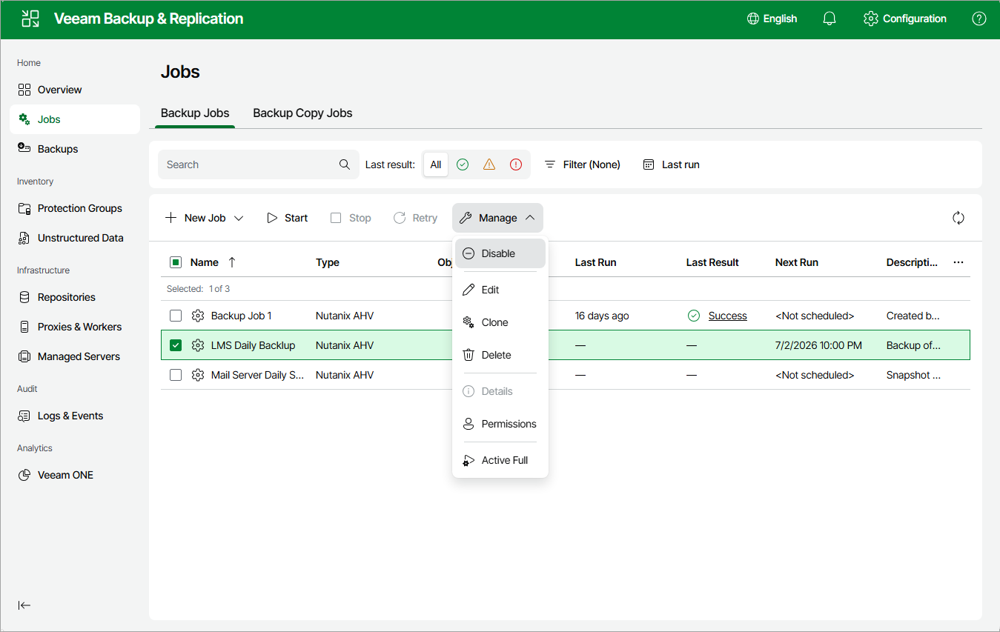

# Enabling and Disabling Jobs

By default, all created jobs run according to the specified schedules. However, you can temporarily disable a job so that it does not run automatically. You will still be able to enable the disabled job at any time you need.

To enable or disable a backup job, do the following:

1. Navigate to Jobs.
2. Select the necessary job.
3. Click Manage > Enable or Disable.

Page updated 2026-07-08

