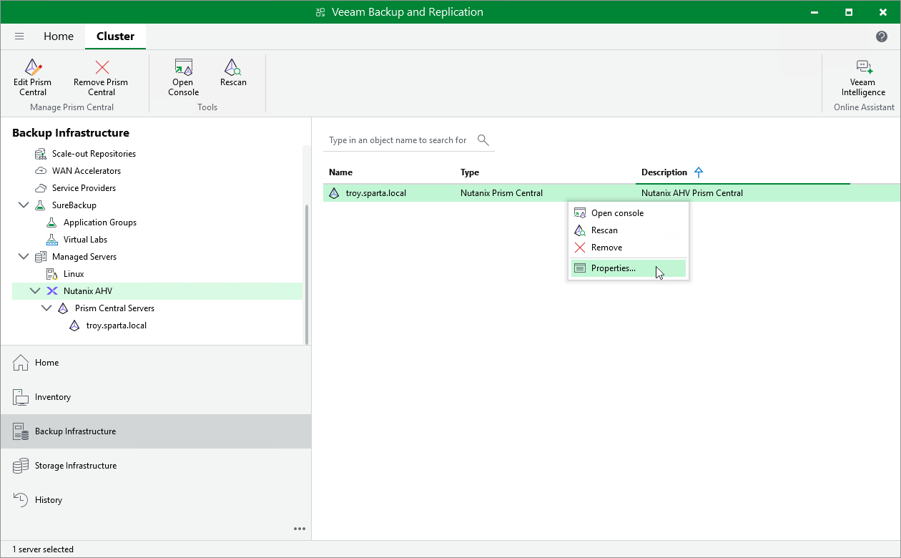

# Editing Nutanix AHV Server Properties

To edit properties of the Prism Central or cluster added to the backup infrastructure, do the following:

1. Open the Backup Infrastructure view.
2. In the inventory pane, select Managed Servers > Nutanix AHV.
3. In the working area, select the Prism Central or cluster and click Edit on the ribbon, or right-click the Prism Central or cluster and select Properties.
4. Complete the Edit Nutanix AHV Server wizard as described in section [Adding Nutanix AHV Server to Backup Infrastructure](ahv_add_ahv_cluster.md).

