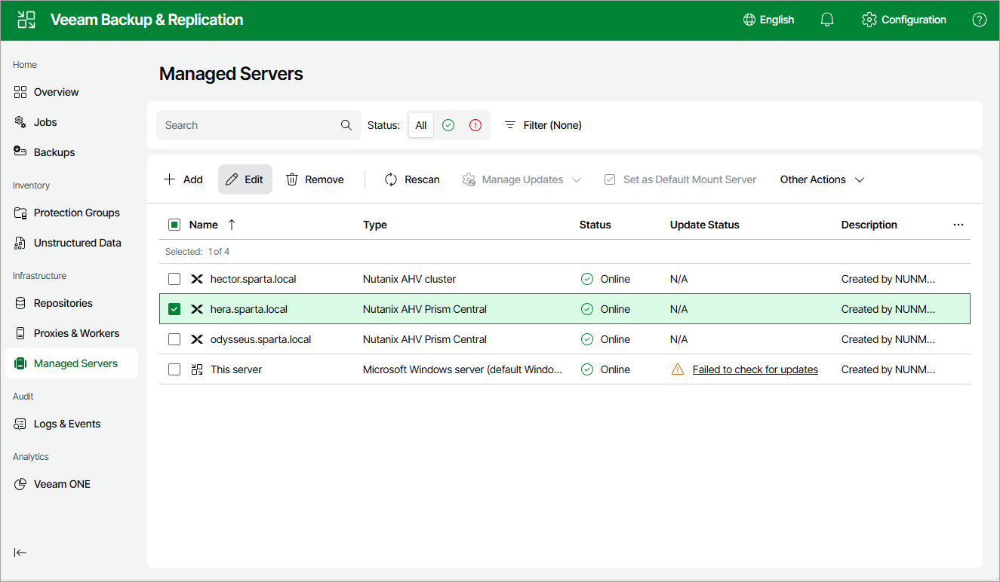

# Editing Nutanix AHV Server Properties

To edit properties of the Prism Central or cluster added to the backup infrastructure, do the following:

1. Navigate to Managed Servers.

1. Select the necessary Prism Central or cluster and click Edit on the menu, or right-click the Prism Central or cluster and select Edit.

1. Complete the Edit Server wizard as described in section [Adding Nutanix AHV Server to Backup Infrastructure](ahv_add_ahv_cluster_web.md).

Page updated 2026-07-07

