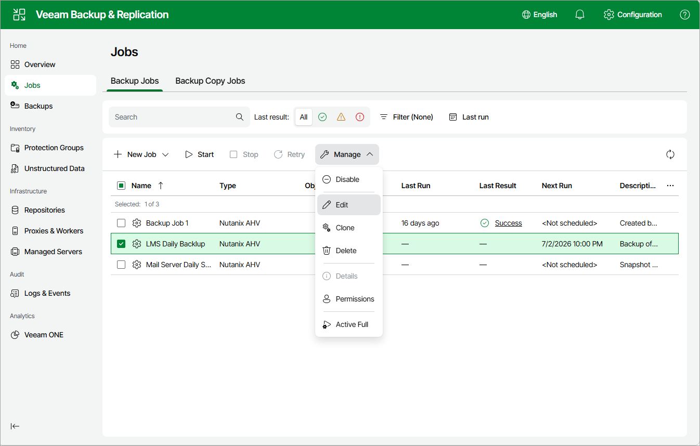

# Editing Job Settings

For each job, you can modify settings configured while creating the job. To do that:

1. Navigate to Jobs.
2. Select the necessary job.

You can select the job for editing even when it is running.

1. Click Manage > Edit:

* To provide a new name and description for the job, follow the instructions provided in section [Creating Backup Jobs](ahv_backup_job_vbr_general_settings_web.md) (step 2).
* To edit the backup scope, follow the instructions provided in section [Creating Backup Jobs](ahv_backup_job_vbr_assign_vms_web.md) (step 3).
* To change the backup repository where backups are stored, to configure backup job retention settings, to schedule active and synthetic full backups, to configure health checks and email notifications, follow the instructions provided in section [Creating Backup Jobs](ahv_backup_job_vbr_destination_web.md) (step 4).
* To modify settings for application-aware processing of VMs included into the backup scope, follow the instructions provided in section [Creating Backup Jobs](ahv_backup_job_vbr_guest_processing_web.md) (step 5).
* To modify the job schedule and configure automatic retry settings, follow the instructions provided in section [Creating Backup Jobs](ahv_backup_job_vbr_schedule_web.md) (step 6).
* At the Summary step of the wizard, review configuration information and click Finish.

Page updated 2026-07-16

