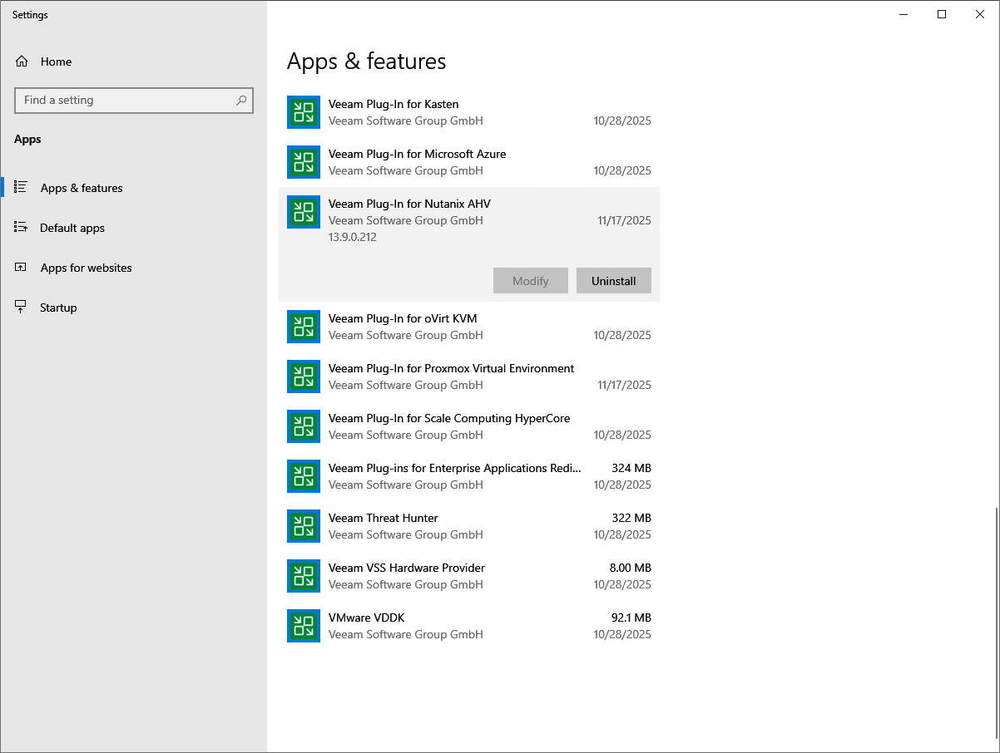
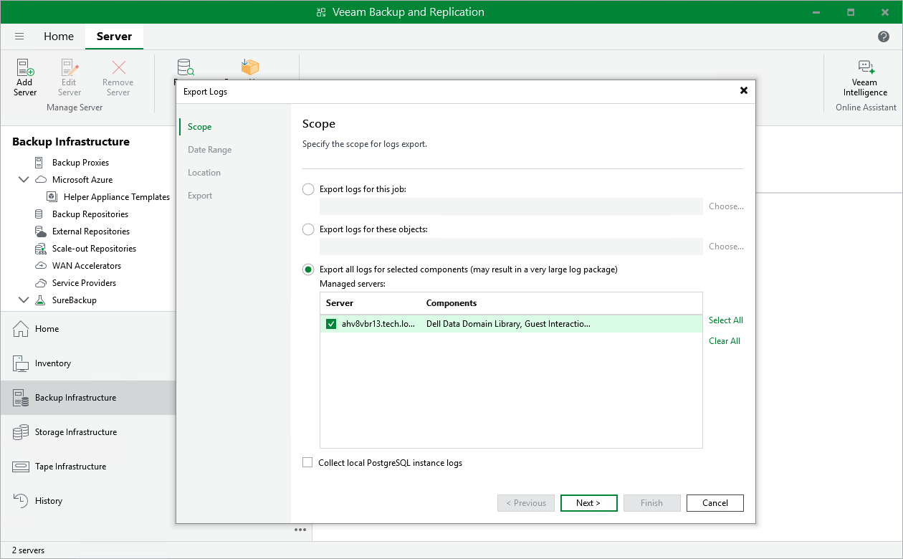

# Getting Technical Support

If you have any questions or issues with Veeam Plug-in for Nutanix AHV, you can search for a resolution on [Veeam R&D Forums](https://forums.veeam.com/) or submit a support case in the [Veeam Customer Support Portal](https://www.veeam.com/support.html).

When you submit a support case, it is recommended that you provide the Veeam Customer Support Team with the following information:

* [Version information for the product and its infrastructure components](#ViewingProductDetails)
* The error message or an accurate description of the problem you are facing
* [Log files](#DownloadingLogs)

Viewing Product Details

To view the product details, do the following:

1. On the machine where the Veeam Backup & Replication console is installed, navigate to the Control Panel.
2. In the Control Panel window, navigate to Programs > Programs and Features.
3. In the program list, check the version of Veeam Plug-in for Nutanix AHV.

|  |
| --- |
| Tip |
| [Applies to Linux-based backup servers only] Alternatively, you can view product details in the Veeam Host Management Console as described in section [Performing Maintenance Tasks](hmc_perform_maintenance_tasks.md). |

Downloading Logs

To download the product logs, do the following:

1. From the main menu of the Veeam Backup & Replication console, select Help > Support Information.
2. At the Scope step of the Export Logs wizard, select the Export all logs for selected components option. Then, in the Managed servers list, select the backup server.

Complete the wizard as described in section [Exporting Logs](exporting_logs.md).

