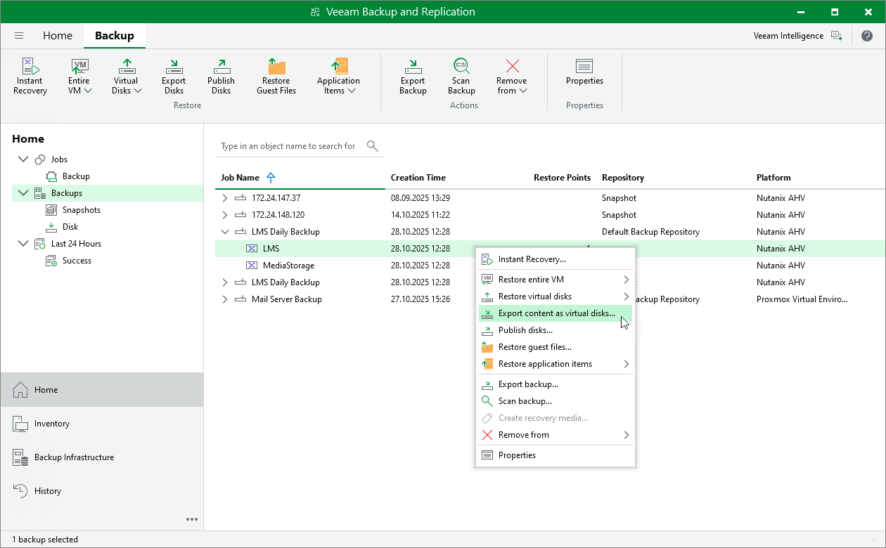

# Exporting Disks

Veeam Backup & Replication allows you to export disks, that is, restore disks from VM backups and convert them to the VMDK, VHD and VHDX formats. You can save the exported disks to any server added to the backup infrastructure or place the disks on a datastore connected to an ESXi host (for the VMDK disk format only). For more information, see [Disk Export](disk_export.md).

To export VM disks, do the following:

1. Open the Home view.
2. In the inventory pane, select Backups.
3. In the working area, expand the necessary backup job, right-click the VM that contains disks you want to export and select Export content as virtual disks.

Alternatively, expand the necessary backup job, select the VM and click Export Disks on the ribbon.

1. Complete the Export Disk wizard as described in section [Exporting Disks](exporting_disks.md).

